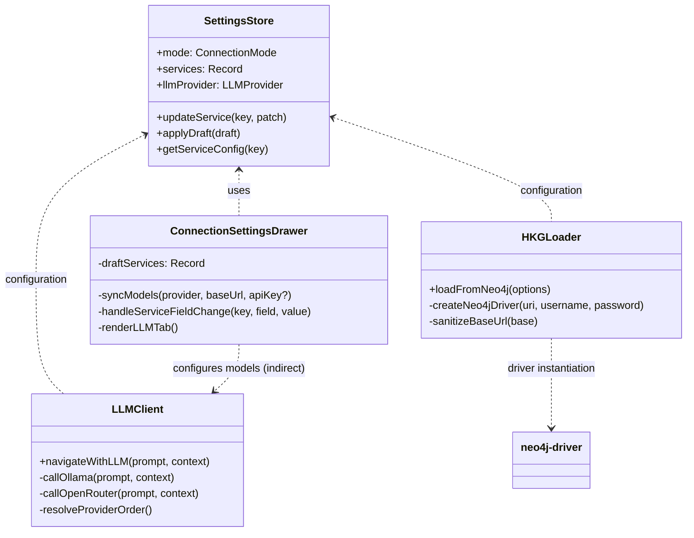
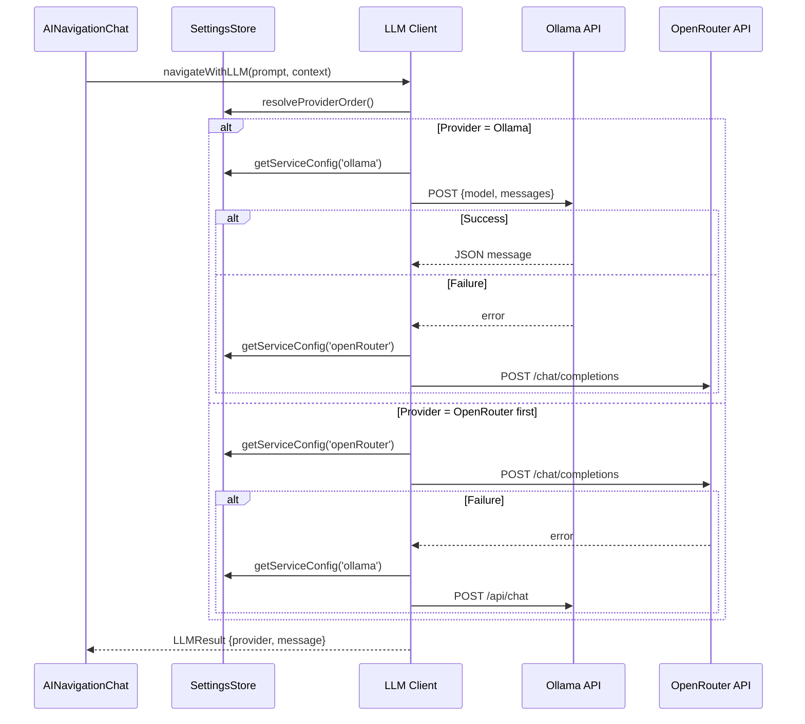

# 2025-09-27 — LLM Connectivity & Neo4j Endpoint Normalization Architecture

## Repository AST Snapshot (Focused Scope)
```
kg3dnav-cr/
  src/
    components/
      ConnectionSettingsDrawer.tsx
        - React.FC ConnectionSettingsDrawer(props)
          • Local state: draftMode, draftUnifiedBaseUrl, draftServices, draftLLMProvider, modelOptions, etc.
          • Handlers: handleServiceFieldChange, handleSave, handleCancel, handleReset.
          • Side-effects: syncModels(provider, baseUrl, apiKey) → fetch tags list via resolveTagsUrl.
          • Renders connection tab inputs and LLM tab (text inputs + datalist for models).
        - Helper fns: structuredCloneSafe, resolveTagsUrl(baseUrl), extractModelNames(payload).
    services/
      llmClient.ts
        - Types: NavigationContext, LLMResult.
        - Helpers: buildSystemPrompt(context), sanitizeUrl(url, fallback), callWithTimeout(promise, timeoutMs),
          callOllama(prompt, context), callOpenRouter(prompt, context), resolveProviderOrder(), resolveCompletionsUrl(baseUrl).
        - Export: navigateWithLLM(prompt, context) orchestrates provider order.
    state/
      settingsStore.ts
        - Zustand store with persistence for MCP/individual service endpoints and auth.
        - Constants: MCP_DEFAULT, DEFAULT_SERVICE_ENDPOINTS (neo4j bolt://..., etc.), DEFAULT_SERVICE_CONFIGS.
        - Helpers: cloneDefaultServiceConfig, sanitizeBaseUrl, sanitizeAuthValue, sanitizeNumberValue.
        - Store actions: setMode, setLLMProvider, updateUnifiedBaseUrl, updateService, applyDraft, resetToDefaults,
          getMCPBaseUrl, getServiceConfig.
    services/
      hkgLoader.ts
        - Imports neo4j-driver.
        - Helpers: sanitizeBaseUrl(base), createNeo4jDriver(uri, username, password).
        - loadFromNeo4j(options) obtains neo4j config via getServiceConfigSnapshot('neo4j'),
          uses sanitized base to open driver/session.
  docs/
    architecture/ (existing historical docs)
    CHECKLISTS/ (existing checklists)
```

## Problem Analysis
1. **Neo4j endpoint default shows `neo4://` and manual corrections fail**
   - Need stronger normalization of Neo4j URIs when reading/writing settings.
   - UI hints must present `bolt://` / `neo4j://` defaults explicitly.
   - Connection logic should coerce malformed schemes like `neo4://` to valid ones.
2. **LLM connections to Ollama/OpenRouter fail**
   - Improve base URL sanitation (ensure trailing paths, protocols) and request handling.
   - For Ollama, ensure CORS/timeouts handled gracefully; prefer explicit headers.
   - For OpenRouter, verify completions endpoint resolution and required headers; adopt better error surfacing.
3. **Model selection input should be dropdown populated from API tags**
   - Replace free-text datalist with controlled combo (select + optional custom entry).
   - Fetching tags must use provider-specific endpoints (Ollama `/api/tags`, OpenRouter `/api/v1/models`).

## Proposed Modifications
### 1. Settings Normalization Layer
- Introduce `normalizeNeo4jUri(raw: string | undefined): string` in `settingsStore.ts`.
  - Trim, default to `DEFAULT_SERVICE_ENDPOINTS.neo4j` when blank.
  - If scheme `neo4://` → replace with `neo4j://`.
  - Accept `bolt://`, `neo4j://`, `neo4j+s://`, `neo4j+ssc://`.
  - If missing scheme, prefix with `bolt://`.
- Apply `normalizeNeo4jUri` when:
  - Building `DEFAULT_SERVICE_CONFIGS.neo4j`.
  - Persisting drafts (`applyDraft`) and snapshots (`getServiceConfig`).
  - Resetting defaults.
- Ensure UI placeholders and reset hints use normalized scheme string.

### 2. Neo4j Driver Creation Hardening
- In `hkgLoader.ts` adjust `sanitizeBaseUrl` or new helper to call `normalizeNeo4jUri` (import from store?) or replicate logic.
- Optionally verify connectivity via `await driver.verifyConnectivity()` before running queries; provide descriptive error when failing.

### 3. LLM Client Robustness
- Enhance `sanitizeUrl` to accept provider-specific normalization (Ollama vs OpenRouter) using dedicated helper functions.
- For Ollama:
  - Guarantee pathless base (strip `/api/chat` if user includes it).
  - Provide friendly error message if fetch fails or returns error JSON.
- For OpenRouter:
  - Ensure base resolves to `https://openrouter.ai/api/v1/chat/completions` when user enters host only.
  - Validate API key presence, bubble up descriptive message.
  - Possibly add `referrer` header using `window.location.origin` fallback when available.

### 4. Model Combobox Revamp
- Replace `<input list>` with `<select>` dropdown plus optional custom entry toggle in `ConnectionSettingsDrawer` for each provider.
  - For Ollama + OpenRouter sections: render `<select>` using `modelOptions[provider].values` with leading option "Select a model" and trailing "Custom...".
  - When "Custom..." chosen, show adjacent text input for manual entry.
  - Maintain `draftServices.*.model` binding.
- Update `syncModels` to use provider-specific tag endpoint resolution:
  - For Ollama: `${base}/api/tags` (existing logic with sanitation).
  - For OpenRouter: `https://openrouter.ai/api/v1/models` derived from base host (strip `/chat/completions`).
  - Parse responses into string arrays (OpenRouter returns `{ data: [{ id, name, pricing...}] }`). Extract `id`.

### 5. UX & Messaging Tweaks
- Display active provider + model in chat message footer (dynamic using stored config snapshot) rather than static `x-ai/grok-4-fast:free` string.
- Provide error messaging linking to settings when LLM request fails, referencing provider order.

## UML & Mermaid Representations

### Component Relationship Diagram


### Sequence Diagram – LLM Navigation Flow (Post-modification)


## Knowledge Graph Sync
*Attempted alignment with external Hybrid Knowledge Graph services (Neo4j/Qdrant/Postgres) is not feasible within the current execution environment; pending integration once network credentials & drivers are accessible.*

