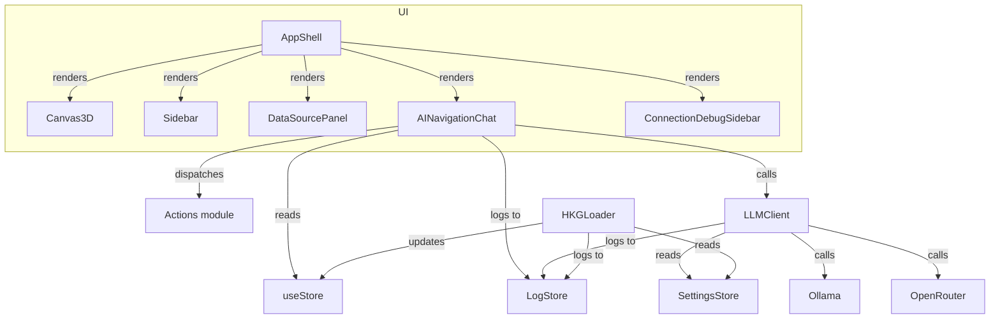

# Architecture Plan — LLM Agentic Navigation & Connection Debug Sidebar (2025-09-27)

## Context & Baseline Alignment
- Repository: `kg3dnav-cr` — React 18 + Zustand + Three.js (via @react-three/fiber) front-end wrapped in Tauri 2 shell.
- Core functional areas (current as-of-plan):
  - `src/components/AINavigationChat.tsx`: combines heuristic keyword extraction with `navigateWithLLM()` fallback to remote LLM providers.
  - `src/services/llmClient.ts`: constructs provider-specific payloads for Ollama & OpenRouter using sanitized endpoints from `settingsStore`.
  - `src/services/hkgLoader.ts`: orchestrates knowledge-graph data retrieval from Neo4j/Qdrant/Postgres via MCP/unified/per-service modes.
  - `src/state/settingsStore.ts`: persists endpoints, credentials, and provider preferences; normalizes Neo4j URIs.
  - `src/state/store.ts`: global graph visualization state (entities, relationships, layout, captions, etc.).
- Hybrid Knowledge Graph (HKG) sync attempt: `curl http://mcp.robinsai.world:7474` responded `503 Service Unavailable` at plan time, preventing live AST/architecture ingestion from HKG. Plan proceeds using repo sources; HKG update will be revisited after implementation if connectivity succeeds.

## Architectural Goals
1. **Agentic LLM navigation**: eliminate pre-LLM heuristic filtering so the chat passes full conversational history to backend LLM, enabling richer action directives (highlighting, layout changes, insights) from the model itself.
2. **Action execution channel**: interpret structured directives returned by the LLM (e.g., JSON actions) and map them onto existing state actions (`highlightEntities`, `setTargetEntity`, `setLayout`, etc.).
3. **High-verbosity connection diagnostics**: instrument HKG loaders (Neo4j/Qdrant/Postgres/MCP detection) to emit trace-level events into a new observable log store, surfaced via a dockable, resizable debug sidebar for operator troubleshooting.
4. **Telemetry persistence**: ensure all LLM requests/responses and connection attempts feed into the new log stream for unified visibility.

## Proposed Modules & Changes

### 1. Logging Infrastructure
- **New file** `src/state/logStore.ts` exporting a Zustand store:
  - State: `entries: LogEntry[]`, `isVisible: boolean`, `dock: 'left' | 'right'`, `width: number`.
  - Actions: `append(entry)`, `clear()`, `setVisible(bool)`, `setDock(side)`, `setWidth(px)`.
  - `LogEntry` structure: `{ id: string; timestamp: string; level: 'debug'|'info'|'warn'|'error'; source: string; message: string; detail?: unknown }`.
  - Provide selectors/hooks: `useLogEntries()`, `useLogControls()` for components/services.
- **Utility** `logDebug`, `logInfo`, `logWarn`, `logError` helpers returning void but pushing structured entries.

### 2. Debug Sidebar Component
- **New component** `src/components/ConnectionDebugSidebar.tsx`:
  - Uses `useLogEntries`, `useLogControls` to render real-time log stream.
  - Layout: absolutely positioned panel anchored to left or right, default width 360px, `style={{ resize: 'horizontal', overflow: 'auto' }}` for manual resizing.
  - Controls: toggle visibility button, dock switch (left/right), clear logs, pause auto-scroll.
  - Display: high-contrast list showing timestamp, level badge, source tag, message, JSON inspector (stringified detail).
  - Accepts optional prop `initiallyOpen?: boolean` to auto-open when errors appear (subscribe to store inside component for effect).

### 3. Instrumentation Hooks
- Update `src/services/hkgLoader.ts`:
  - Import log helpers; wrap key operations (MCP discovery, Neo4j driver creation, connectivity verification, query execution, fallback) with `logDebug`/`logInfo`/`logWarn`/`logError`.
  - On errors, include sanitized endpoint & credentials metadata (without passwords) in `detail`.
  - Ensure logs also capture success path (entities/relationships counts) and selected connection mode.
- Update `src/services/llmClient.ts`:
  - Accept structured chat history; log request metadata (provider, model, endpoint) and response/outcome.
  - Parse JSON content for `actions` & `reply` fields; log parse failures.

### 4. LLM Agentic Pipeline
- **Type updates** in `llmClient.ts`:
  - Introduce `ChatMessageParam = { role: 'system'|'user'|'assistant'; content: string }`.
  - Change `navigateWithLLM(messages: ChatMessageParam[], context: NavigationContext): Promise<LLMResult>`.
  - `LLMResult` now `{ provider: 'ollama'|'openrouter'|'fallback'; message: string; actions: LLMAction[]; raw: string }` where `LLMAction` enumerates actionable directives (highlightEntities, setTargetEntity, setLayout, analyzeEntity, sendQuery, followRelationship, etc.).
  - Expand `buildSystemPrompt` to instruct output format: JSON object with `reply` (Markdown) and `actions` array using defined schema. Provide reference of available actions and knowledge graph summary (highlighted entities, current target, counts) derived from `context`.
- **Parsing**: after retrieving message string from provider, attempt to locate JSON block (first/last `{` ... `}` or fenced code). Validate schema; fallback to empty actions on failure while logging warning.
- **Backwards compatibility**: still return textual message for display even if JSON missing.

### 5. AINavigationChat Overhaul
- Remove heuristic functions (`processNavigationRequest`, `extractKeywords`, etc.).
- Maintain chat history state: array of `{ id, type, content, timestamp, provider? }` but now store role-labeled data for conversation.
- On send:
  - Append user message.
  - Build `messages` array from chat history (converted to `ChatMessageParam`), injecting system prompt automatically inside `navigateWithLLM` call.
  - Display provisional assistant bubble showing "Consulting navigation agent..." while awaiting result.
  - Once `LLMResult` arrives, update message with `reply` text; annotate `provider`.
  - Iterate through `actions` and dispatch mapped functions from `src/state/actions.ts` (highlightEntities, setTargetEntity, setLayout, sendQuery, analyzeEntity, followRelationship, clearAllHighlights, etc.). Log each executed action via log store.
  - Append fallback error message if request fails; expose "Open settings" button as before when provider unreachable.
- Provide manual "Open Debug Log" button linking to new sidebar toggle.

### 6. App Shell Integration
- Update `src/components/AppShell.tsx` to render `<ConnectionDebugSidebar />` anchored above Canvas (ensuring pointer events, z-index) and provide quick toggle button near Settings/ About cluster if hidden.

### 7. Types & Context Extensions
- Add new helper `getGraphContextSnapshot()` (maybe in new `src/services/contextSnapshot.ts` or within `AINavigationChat`) to gather counts, highlight arrays, target entity, etc., to pass into `navigateWithLLM` context for prompt building.

### 8. Documentation & Tests
- Document new agent response schema in inline comments and ensure TypeScript definitions align.
- Consider unit-likes: due to environment, rely on TypeScript compile via `npm run build`? (makes sense to run `npm run build` or `npm run lint` for verification).

## Sequence Diagram (Mermaid)
```mermaid
title Agentic Navigation Flow
sequenceDiagram
    participant User
    participant ChatUI as AINavigationChat
    participant LLM as navigateWithLLM
    participant Actions as State Actions
    participant Log as LogStore

    User->>ChatUI: Enter navigation request
    ChatUI->>Log: append(debug: "user_message")
    ChatUI->>LLM: messages[], context snapshot
    LLM->>Log: append(debug: "llm_request")
    LLM-->>ChatUI: {reply, actions[], provider}
    ChatUI->>Log: append(info: "llm_response")
    ChatUI->>Actions: dispatch(action)
    Actions->>Log: append(debug: "action_executed")
    ChatUI-->>User: Render reply + highlights
```

## Component Diagram (Mermaid)


## Neo4j/Qdrant/Postgres Graph Sync
Connectivity to the shared HKG data plane is currently unavailable (Neo4j HTTP endpoint returns 503). After implementing this plan, attempt to push architecture + checklist metadata to HKG via provided credentials; if connection remains blocked, capture failure logs in the new debug sidebar for operator visibility.

