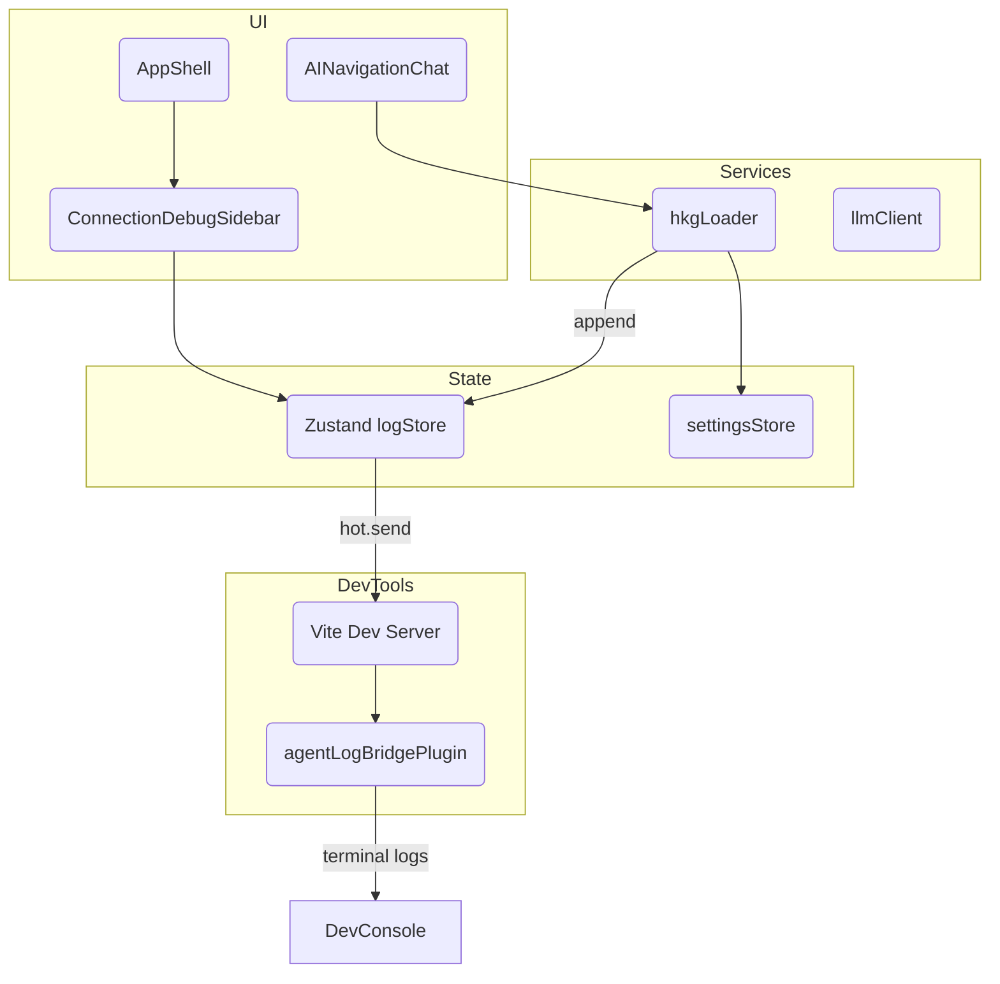
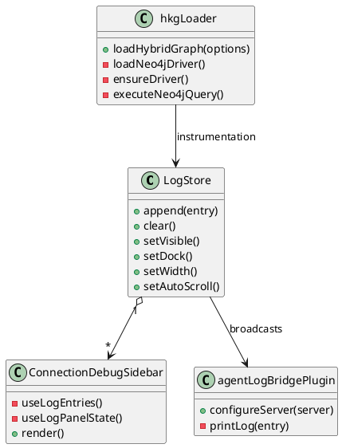

# Agentic Logging & Neo4j Connectivity Architecture — 2025-09-27T22:13:52Z

## Baseline Repository AST Snapshot
```
kg3dnav-cr/
├─ src/
│  ├─ components/
│  │  ├─ AppShell.tsx — top-level layout shell orchestrating Canvas3D, Sidebar, chat, settings, and ConnectionDebugSidebar.
│  │  ├─ AINavigationChat.tsx — agent chat UI issuing graph actions, streaming responses, executing structured payloads.
│  │  ├─ ConnectionDebugSidebar.tsx — Zustand-powered dockable log viewer with auto-scroll, docking, and filtering UI.
│  │  ├─ ConnectionSettingsDrawer.tsx — configuration surface for Neo4j/Qdrant/Postgres/LLM endpoints.
│  │  └─ Additional panels (Canvas3D, DataSourcePanel, Sidebar, etc.) providing scene rendering and controls.
│  ├─ services/
│  │  ├─ hkgLoader.ts — primary hybrid knowledge graph loader orchestrating Neo4j direct mode, MCP fallbacks, Qdrant search, and Postgres audit retrieval.
│  │  ├─ llmClient.ts — chat transport to Ollama/OpenRouter, structured response parsing, telemetry emission.
│  │  └─ contextSnapshot.ts — snapshotting app state to feed into LLM actions.
│  ├─ state/
│  │  ├─ logStore.ts — Zustand store capturing log entries, sidebar docking state, auto-scroll, unread counts.
│  │  └─ settingsStore.ts — persisted configuration for endpoints, credentials, and toggles.
│  └─ config/, types/, utils/ — build metadata, environment normalization, shared type aliases.
├─ docs/
│  ├─ ARCHITECTURE/ — timestamped design records (Neo4j fixes, agentic debug sidebar, current log bridge plan).
│  └─ CHECKLISTS/ — execution task lists for previous iterations.
└─ vite.config.ts — React plugin setup, build metadata injection, pending log bridge plugin.
```

## Observed Integration Gaps
- **Neo4j driver import:** `hkgLoader.ts` uses a static ESM import of `neo4j-driver`, causing Rollup to fail bundling for the browser build and preventing dev/test.
- **Terminal visibility:** Connection logs are confined to the in-app `ConnectionDebugSidebar`, forcing developers to keep the panel open during debugging.
- **Graph telemetry wiring:** Log store events do not emit to external observers (Neo4j/Qdrant/Postgres instrumentation cannot be mirrored to Vite's terminal).

## Proposed Solution Overview
1. **Dynamic Neo4j Module Loader**
   - Replace the static `import neo4j from 'neo4j-driver'` with a lazy loader (`loadNeo4jDriver()`) guarded by `@vite-ignore` dynamic import to avoid bundling while retaining Tauri compatibility.
   - Cache the module reference and expose helpers returning `{ driver, auth }` utilities; emit structured log events before/after critical driver lifecycle steps.
2. **Vite Dev Console Bridge**
   - Extend `logStore.append` to broadcast each log entry through `import.meta.hot?.send('hkg:log', payload)` when running under Vite dev, and mirror to `console` for both browser + Node contexts.
   - Introduce a Vite plugin (`agentLogBridgePlugin`) that listens on the dev server WebSocket channel `hkg:log` and prints color-coded messages (level/source/message/detail) to the terminal.
3. **Neo4j Connectivity Diagnostics**
   - Harden `hkgLoader` error paths to capture driver/session lifecycle states, including failed dynamic loads, authentication errors, and handshake failures with actionable details (URI, username, sanitized error message).
   - Surface next steps via logs and gracefully fall back to MCP endpoints when direct driver access is unavailable.
4. **Knowledge Graph Alignment Attempt**
   - Attempt to fetch the existing hybrid graph via `http://mcp.robinsai.world:7474/`; currently returns HTTP 503 (service unavailable). Record the failure, log via `logError`, and annotate in docs for follow-up once the service is reachable.

## Component Interaction Diagram (Mermaid)


## Class/Module Relationships (UML)


## Planned Files & Changes
- `src/services/hkgLoader.ts`
  - Introduce `loadNeo4jDriver()` dynamic loader and adapt driver/session lifecycle functions.
  - Update logging to capture dynamic load failures, sanitized credentials usage, and fallback triggers.
- `src/state/logStore.ts`
  - Wrap `append` to mirror entries to `console` and Vite HMR channel when available.
  - Export `bridgeLogToDevServer(entry)` helper for reuse/testing.
- `vite.config.ts`
  - Register `agentLogBridgePlugin` to listen for `hkg:log` events and print structured terminal output with level-based coloring.
  - Optionally expose plugin toggles via environment flag if needed.
- Documentation updates
  - Record knowledge graph connection attempt outcome and align checklist.

## Knowledge Graph Synchronization Note
Attempted to query Neo4j endpoint (`http://mcp.robinsai.world:7474/`) and received HTTP 503. Unable to read or update hybrid knowledge graph at this time; will retry post-implementation or once service availability is restored.
