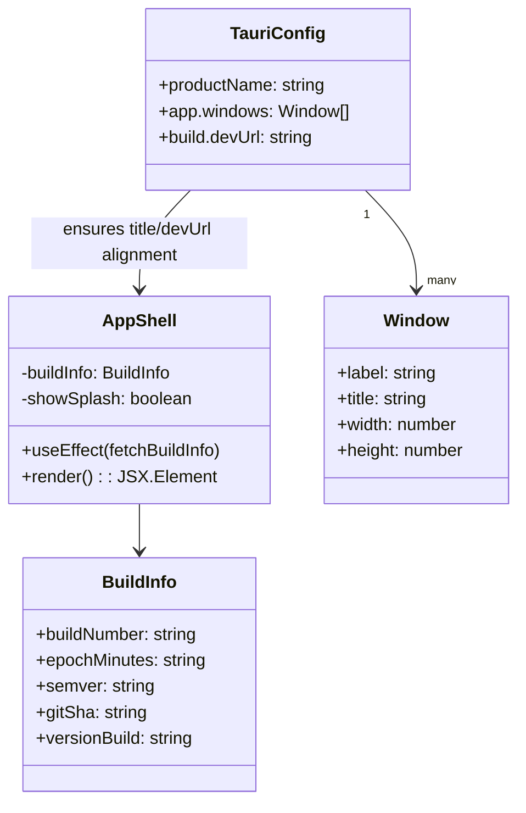

# Architecture Plan — 2025-09-28 — Window Title & Blank Screen Regression

## Repository Baseline (Abstracted AST Snapshot)

```text
kg3dnav-cr/
├── index.html — HTML shell mounting React root (#root)
├── src/
│   ├── main.tsx — React entrypoint; renders <AppShell/> inside ErrorBoundary
│   ├── components/
│   │   ├── AppShell.tsx — orchestrates layout, splash/about modals, fetches build info
│   │   ├── Canvas3D.tsx → Scene3D.tsx → KnowledgeNode.tsx — 3D rendering via @react-three/fiber
│   │   ├── Sidebar.tsx, DataSourcePanel.tsx, AINavigationChat.tsx, ConnectionSettingsDrawer.tsx, etc.
│   ├── config/buildInfo.ts — synthesises build metadata, Tauri bridge helper
│   ├── services/ — hKG loaders, layout engine, JSON import helpers
│   ├── state/store.ts — Zustand global store exposing selectors/actions
│   ├── state/actions.ts — imperative helpers mutating store
│   └── types/knowledge.ts — Entity/Relationship/build info typings
├── src-tauri/
│   ├── src/main.rs — Tauri 2 entrypoint, registers `get_build_info` command, menu wiring
│   ├── build.rs — emits BUILD_* env vars during compile
│   ├── Cargo.toml — Rust package manifest
│   └── icons/ — app icons
├── tauri.conf.json (root) — intended runtime/build configuration (currently unused by Tauri CLI)
└── vite.config.ts — Vite config, build-time constants, agent log bridge plugin
```

Key observation: Tauri CLI expects `src-tauri/tauri.conf.json`; current configuration lives at repo root, so dev/build fall back to template defaults (window title "Barnstormer", dev server URL 1420). Dev workflow also assumes Vite listening on port 49200 but the default `vite` command binds 5173, causing a white window inside Tauri.

## Problem Statements

1. **Window title regressed to "Barnstormer"** — Tauri is not loading the intended configuration (title `3D Knowledge Graph Navigator`).
2. **Tauri window shows blank screen** — The webview points at `http://localhost:1420` (default) while Vite dev server runs at 5173; mismatch yields empty content.

## Proposed Solution Architecture

### Configuration Flow

- Relocate the production/development configuration into `src-tauri/tauri.conf.json`, ensuring Tauri 2 loads it automatically.
- Define explicit window `label` and `title`, `width`, `height`, `resizable` flags.
- Keep `build.frontendDist` and `build.devUrl` aligned with Vite build output and dev server port.
- Remove or convert the root `tauri.conf.json` to avoid divergence (source of truth: `src-tauri/tauri.conf.json`).

### Tooling Alignment

- Update `package.json` scripts so `npm run dev` starts Vite on port `49200` (matching `build.devUrl`).
- Optionally expose shared `VITE_DEV_SERVER_PORT` constant if future tooling needs it (not required for minimal fix).

### Runtime Guarantees

- (Optional hardening) Add a lightweight Tauri setup hook ensuring the window title is set programmatically from config to guard against misconfiguration. Given the config relocation, the runtime will respect the new value without additional Rust changes; we keep Rust untouched for minimal scope.

## UML / Mermaid Overview

```mermaid
flowchart TD
    subgraph Frontend
        A[Vite Dev Server (React 18)] -->|serves /src/main.tsx| B[AppShell]
    end

    subgraph Desktop
        C[Tauri Builder (src-tauri/src/main.rs)] --> D{Config Loader}
        D -->|reads| E[src-tauri/tauri.conf.json]
        E --> F[Window(main)\n• title: "3D Knowledge Graph Navigator"\n• devUrl: http://localhost:49200]
        C -->|invoke| G[get_build_info command]
        G -->|populate| H[AppShell.buildInfo]
    end

    B -.->|useBuildInfo| H
    F -->|loads| A
```



## Data / Config Tables

| Concern | Current State | Target State |
| --- | --- | --- |
| Tauri config path | `./tauri.conf.json` (ignored) | `./src-tauri/tauri.conf.json` (authoritative) |
| Window title | Defaults to template (“Barnstormer”) | `3D Knowledge Graph Navigator` |
| Dev server URL | Default `http://localhost:1420` | `http://localhost:49200` |
| `npm run dev` port | Vite default 5173 | `vite --port 49200` |

## Implementation Notes

- Deleting the obsolete root `tauri.conf.json` prevents future drift. If downstream tooling expects a root file, replace it with a stub referencing the canonical location.
- After changes, `tauri dev` will spawn Vite at 49200 via script, matching the config’s `devUrl` and restoring UI rendering.
- No changes required to Rust or React components beyond configuration alignment.

*Hybrid Knowledge Graph Sync*: Environment lacks direct access to the shared Neo4j/PostgreSQL/Qdrant endpoints; record of this architecture is stored locally in this document. Synchronisation to external HKG is deferred until connectivity is available.
