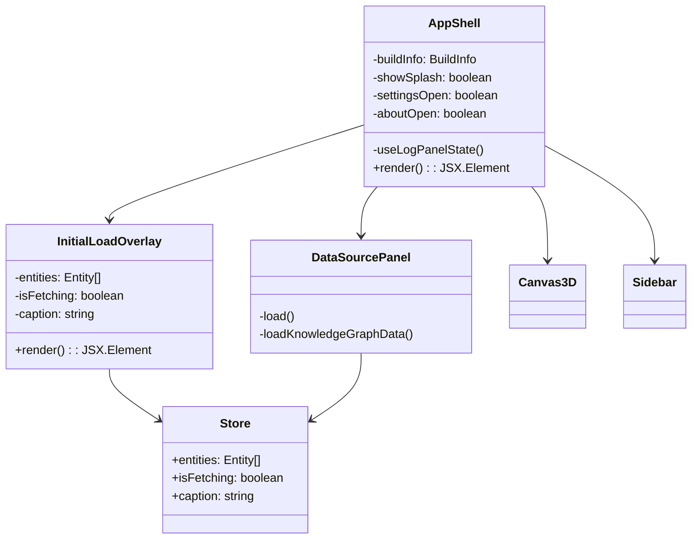
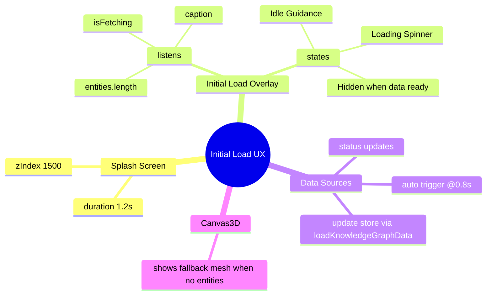

# Architecture — Initial Load Experience Overlay (2025-09-29T04:03:48Z)

## Context & Scope
- Repository: `kg3dnav-cr`
- Goal: address "blank background screen on load init" by introducing an initial load overlay that communicates application state while knowledge graph data is fetched.
- Constraints: unable to interface with external hybrid knowledge graph infrastructure from this environment; planned architecture reflects repository reality only.

## High-Level System Overview
```
kg3dnav-cr
├── src
│   ├── main.tsx — React entry point bootstrapping <AppShell/> inside an ErrorBoundary
│   ├── components
│   │   ├── AppShell.tsx — orchestrates layout (Canvas3D, Sidebar, panels, drawers, splash/about modals)
│   │   ├── Canvas3D.tsx — react-three-fiber <Canvas> hosting <Scene3D/>
│   │   ├── Scene3D.tsx — renders lights, controls, graph nodes/relationships, fallback mesh when no data
│   │   ├── DataSourcePanel.tsx — manages data source selection & auto-load flow
│   │   ├── Sidebar.tsx — entity list & interactions (conditional on store.isSidebarOpen)
│   │   └── ... (AINavigationChat, Connection settings/debug UIs, modals)
│   ├── state
│   │   ├── store.ts — zustand store (entities, relationships, layout, UI flags)
│   │   └── actions.ts — mutators (loadKnowledgeGraphData, layout toggles, search, etc.)
│   ├── services — integration with HKG backends (Neo4j/Qdrant/Postgres), layout engine, file loaders
│   ├── types — TypeScript definitions (Entity, Relationship, BuildInfo, etc.)
│   └── config — build metadata utilities
├── index.html — injects global styles, mounts #root
└── src-tauri — desktop wrapper (not directly touched here)
```

## Existing Rendering Flow (Abstract AST Perspective)
```
ReactDOM.createRoot(#root)
└── <StrictMode>
    └── <ErrorBoundary>
        └── <AppShell>
            ├── <Canvas3D>
            │   └── <Canvas style.background gradient>
            │       └── <Scene3D>
            │           ├── <lights>
            │           ├── <TrackballControls>
            │           ├── Conditional fallback geometry when entities.length === 0
            │           └── Map entities/relationships → <KnowledgeNode/> & <RelationshipLine/>
            ├── <Sidebar/> (rendered only when store.isSidebarOpen)
            ├── <DataSourcePanel/> (always mounted; owns auto-load timers & status UI)
            ├── <AINavigationChat/>, <ConnectionDebugSidebar/>, <ConnectionSettingsDrawer/>
            ├── Header buttons (About, Settings, Logs)
            ├── Version badge (bottom-right)
            ├── Conditional overlays
            │   ├── {showSplash && <SplashScreen/>}
            │   └── {aboutOpen && <AboutModal/>}
            └── (No current overlay specifically for "no data yet" state once splash hides)
```

## Problem Characterization
- After splash screen auto-dismisses (~1.2s), there is a visual gap before data loads or user opens panels.
- During this gap the viewport shows only the gradient background (Canvas with no graph + hidden sidebar), leading to "blank screen" perception.
- Need a persistent, informative overlay for "no data loaded" & "currently loading" states using existing zustand flags (`entities`, `isFetching`, `caption`).

## Proposed Solution Architecture
### Components & State
1. **`InitialLoadOverlay.tsx` (new)**
   - Props: none; consumes zustand selectors (`useEntities`, `useIsFetching`, `useCaption`).
   - Derived flags:
     - `hasEntities = entities.length > 0`
     - `isBusy = useIsFetching()`
     - `message = caption || defaultText`
   - Render logic:
     - When `hasEntities` → render `null` (overlay hidden).
     - Else render a fixed-position overlay card (semi-transparent dark background) with:
       - App title & short guidance (e.g., "Loading knowledge graph…" or "Use data sources panel to connect").
       - Animated spinner indicator when `isBusy`.
       - Additional context lines (wired to `message`).
   - Accessibility: include `role="status"` and `aria-live="polite"` for screen readers.
   - Styling: consistent with existing overlays (rounded corners, blurred background). Use inline styles like other components.

2. **`AppShell` integration**
   - Import `InitialLoadOverlay`.
   - Render overlay near end of `main` but above splash/about order so z-index layering remains: ensure overlay sits below splash (zIndex < 1500) but above Canvas (zIndex ~?). Example `zIndex: 900`.
   - The overlay should stay visible even after splash disappears until data arrives.

3. **Optional caption wiring**
   - `loadKnowledgeGraphData` already sets `caption`. No changes required, but ensure fallback message covers zero caption scenario.

### Interaction Sequence
```
AppShell mount
├─ showSplash=true (0-1.2s) → SplashScreen visible (zIndex 1500)
├─ InitialLoadOverlay sees hasEntities=false → renders guidance card (zIndex 900)
├─ DataSourcePanel auto triggers load → store.isFetching toggles true → overlay shows spinner & "Loading..."
└─ Once data arrives (entities.length > 0) → overlay unmounts automatically, revealing graph + UI
```

## UML / Mermaid Diagrams
### Component Collaboration (Mermaid Class Diagram)


### Initial Load Mindmap (Mermaid Mindmap)


## Data Persistence Alignment
- No schema changes; overlay consumes existing store fields.
- No additional dependencies or side effects.

## Testing Strategy
- Manual: run `npm run dev`, observe overlay presence pre-data, verify disappearance post-load.
- Automated: rely on TypeScript compile (`npm run build`) ensuring new component types valid.

