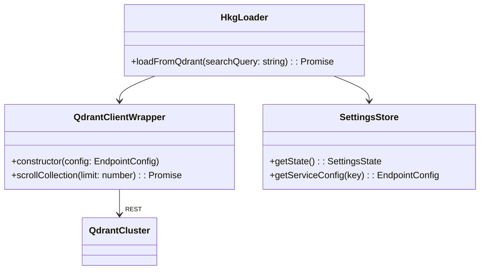

# Architecture: Direct Qdrant Connectivity (UTC 20250927-225853)

## Repository Context AST Snapshot

```text
src/
  services/
    hkgLoader.ts
      ├─ loadFromQdrant(searchQuery?): Promise<KnowledgeGraphResult>
      │   ├─ useSettingsStore.getState()
      │   ├─ getServiceConfigSnapshot('qdrant')
      │   ├─ sanitizeBaseUrl
      │   ├─ createQdrantClientInstance
      │   ├─ mapScrollPointToRawResult / rawResultMatchesQuery
      │   ├─ mapQdrantResults
      │   └─ log* utilities
      ├─ mapQdrantResults(raw, searchQuery, mode, endpoint)
      └─ other loader functions (Neo4j/PostgreSQL)
  state/
    settingsStore.ts
      ├─ DEFAULT_SERVICE_CONFIGS.qdrant { baseUrl, apiKey, collection, embeddingModel, dimension }
      └─ useSettingsStore (Zustand store with per-service configs)
```

## Proposed Solution Overview

1. Replace MCP fallback logic in `loadFromQdrant` with direct Qdrant client queries using configured base URL, collection, and API key.
2. Introduce a reusable Qdrant client factory that respects per-service configuration (HTTP URL vs gRPC) and optional API key.
3. Retrieve points directly from the configured collection via `client.scroll`, then locally filter results by `searchQuery` text before mapping into the existing `KnowledgeGraphResult` structure.
4. Update logging to reflect direct connection attempts and remove MCP references.
5. Ensure dependency management adds the official Qdrant REST client (`@qdrant/js-client-rest`).

## Data Flow

```mermaid
flowchart TD
    Settings[useSettingsStore\n(qdrant config)] -->|baseUrl, apiKey, collection| ClientFactory
    ClientFactory --> QdrantClient[@qdrant/js-client-rest]
    QdrantClient -->|scroll| QdrantEndpoint[(Qdrant 6333)]
    QdrantEndpoint -->|points with metadata| Mapper[mapQdrantResults]
    Mapper --> KnowledgeGraphResult
```

## Component Interactions (Class Diagram)



## Implementation Notes

- Determine whether `baseUrl` uses HTTP (port 6333) or gRPC (port 6334). For MVP, use REST (`@qdrant/js-client-rest`) honoring HTTPS vs HTTP.
- Use `serviceConfig.collection` to drive `client.scroll` retrieval (default limit 200) while preserving compatibility with configured embedding metadata for future enhancements.
- Apply lightweight text filtering in-application to honor the user's `searchQuery` until native semantic search is wired through an embedding pipeline.
- Remove `findWorkingMCPServer` dependency from the Qdrant path.

