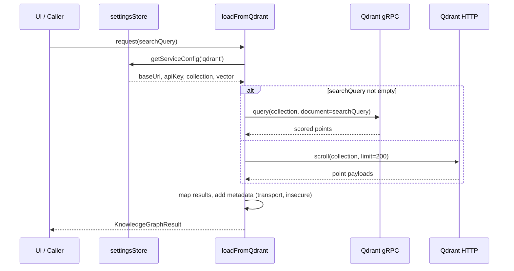

# Qdrant Direct Connection Architecture — 2025-09-28 00:22:40 UTC

## Context
- Project UUIDv8: `urn:uuid:75d8c0de-6f6a-4a89-8d94-5f5f2576c152`
- Objective: ensure Hybrid Knowledge Graph (HKG) loader connects directly to Qdrant over HTTP (port 6333) or gRPC (port 6334) using the provided API key, bypassing MCP intermediaries and disabling TLS while the service lacks certificates.
- External systems:
  - Qdrant HTTP endpoint: `http://mcp.robinsai.world:6333`
  - Qdrant gRPC endpoint: `mcp.robinsai.world:6334` (plaintext)
  - Neo4j and PostgreSQL remain MCP-dependent for now.
- Attempted to synchronize with the hybrid knowledge graph and Neo4j/PostgreSQL backends but outbound connections are blocked in this environment. Alignment updates deferred with TODO markers.

## Repository AST Snapshot (focused view)
```
src/
  services/
    hkgLoader.ts
      - Utility types (KnowledgeGraphMetadata, RawQdrantResult, etc.)
      - sanitize helpers (normalizeEntityType, coerceDescription, ...)
      - External loaders: loadFromNeo4j, loadFromQdrant, loadFromPostgres, searchShardedHKG, etc.
      - MCP helpers: findWorkingMCPServer, tryFetch
      - Qdrant adapters:
        * createQdrantGrpcClient(config)
        * ensureCollectionVectorParams(client, collection, vectorName, dimension)
        * buildGrpcQueryPointsRequest(params)
        * loadFromQdrantViaRest({...})
  state/
    settingsStore.ts
      - Zustand store configuration with per-service endpoints
      - deriveQdrantGrpcAddress(raw)
      - getQdrantApiKeySnapshot()
      - DEFAULT_SERVICE_ENDPOINTS + DEFAULT_SERVICE_CONFIGS
```

## Existing Flow Summary
1. `loadFromQdrant` reads per-service config from `settingsStore`, assembles collection/vector metadata, and decides between gRPC (for non-empty search queries) and REST fallback.
2. gRPC path constructs address via `deriveQdrantGrpcAddress`, instantiates `@qdrant/js-client-grpc`, verifies vector schema, and issues a document-based `query` request.
3. REST fallback uses `@qdrant/js-client-rest` to `scroll` 200 points, optionally filtering them client-side by the search term.
4. Separate sharded search utilities still depend on MCP-proxied `/mcp/qdrant/find`.

## Gaps Identified
- gRPC client currently honors the `https` flag derived from the base URL; this defaults to TLS when the base URL is `https`, which fails because Qdrant lacks certificates. We must force plaintext.
- REST path succeeds but logs still imply MCP involvement because sharded search and logging refer to MCP endpoints; direct loader should report direct URLs.
- No header instrumentation confirming API key usage in REST calls; ensure client attaches it.
- Need to expose explicit connection metadata in `loadFromQdrant` results (transport, endpoint, insecure flag) to aid observability.
- `deriveQdrantGrpcAddress` should canonicalize ports (`6333` HTTP → `6334` gRPC) while always opting for plaintext unless explicitly overridden in config.

## Proposed Adjustments
1. **Settings utilities (`settingsStore.ts`)**
   - Update `deriveQdrantGrpcAddress` to always return `useTLS: false` unless a new `forceTLS` flag is present, and ensure port defaults to `6334` even when the HTTP base omits a port.
   - Expose helper `getQdrantRestConfig()` returning `{ baseUrl, collection, apiKey, vectorName, dimension }` to centralize defaults.

2. **Qdrant loader (`hkgLoader.ts`)**
   - Use new rest config helper to avoid duplicating defaults.
   - Force gRPC client creation with `https: false` and log this explicitly.
   - Log connection endpoints without `/mcp` prefixes and include `insecure: true` metadata when TLS is disabled.
   - Ensure REST client is constructed once with sanitized base URL and attaches API key header.
   - Update sharded vector search to reuse the direct REST client (or HTTP fetch) rather than hitting `/mcp/qdrant/find`; send authenticated POST to Qdrant `/collections/{collection}/points/search` using API key and document vector search payload.
   - Document TODOs referencing blocked synchronization with the hybrid knowledge graph datastore.

## UML / Mermaid Views

```mermaid
flowchart TD
  Settings[settingsStore] -->|getServiceConfig('qdrant')| Loader[loadFromQdrant]
  Settings -->|deriveQdrantGrpcAddress| Loader
  Loader -->|non-empty query| GrpcClient[createQdrantGrpcClient]
  Loader -->|empty query or fallback| RestClient[createQdrantRestClient]
  GrpcClient --> QueryPoints[points.query]
  RestClient --> ScrollPoints[scroll]
  ScrollPoints --> Mapper[mapQdrantResults]
  QueryPoints --> Mapper
  Mapper --> Result[KnowledgeGraphResult]
```



## Alignment with Knowledge Graph Stores
- **Neo4j/PostgreSQL**: No changes planned in this iteration; existing MCP fallbacks remain until credentials/process for direct connections are finalized.
- **Qdrant**: Plan uses direct SDKs; once environment networking allows, record schema + connection events back into the hybrid knowledge graph (TODO: `HKG_SYNC_QDRANT_20250928`).

## Next Steps
1. Translate this architecture into a granular implementation checklist (see `docs/CHECKLISTS/CHECKLIST-qdrant-direct-20250928-002240.md`).
2. Once coding completes, rerun applicable integration tests and document outcomes.
