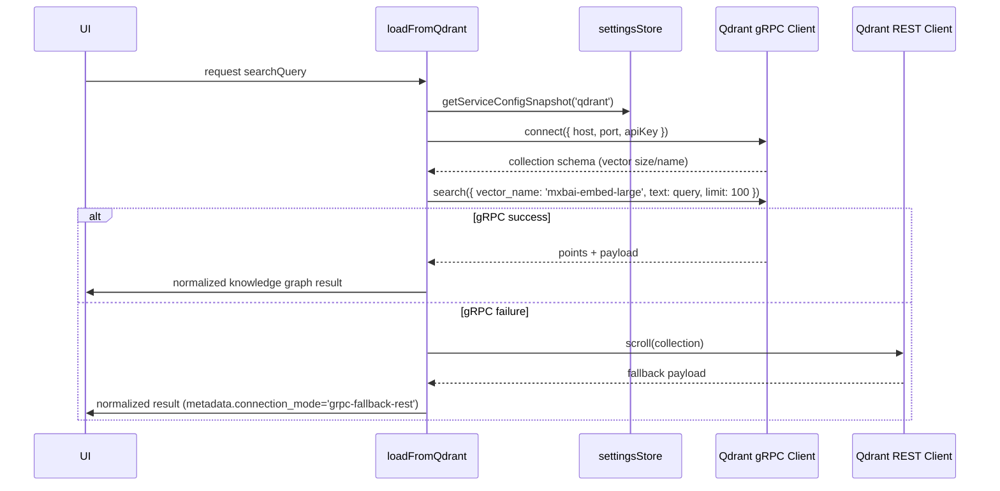

# Architecture • Qdrant gRPC alignment (2025-09-27T23:31:28Z)

## Metadata
- Project UUIDv8: db0293b2-3e87-8f39-be73-960712bd9941
- Timestamp (UTC): 2025-09-27T23:31:28Z
- Scope: Align direct HKG ingestion with Qdrant gRPC endpoint, API-key auth, and 1024-dim `mxbai-embed-large` vectors
- External systems: Qdrant (`http://mcp.robinsai.world:6333` / gRPC `mcp.robinsai.world:6334`), Neo4j, PostgreSQL
- HKG sync status: Attempted `curl` with API key; remote refused connection (`upstream connect error or disconnect/reset before headers`). Qdrant + Neo4j updates pending network availability.

## Baseline AST Abstraction of Relevant Repo Sections
```
kg3dnav-cr/
├─ src/
│  ├─ services/
│  │  └─ hkgLoader.ts
│  │     ├─ loadFromNeo4j(limit?, offset?, ...)
│  │     │   ├─ dynamic neo4j-driver import helpers (loadNeo4jDriver, createNeo4jDriver, verifyNeo4jConnectivity)
│  │     │   ├─ normalizeEntities / normalizeRelationships / normalizeKnowledgeGraphResponse shared utilities
│  │     │   └─ fallback MCP HTTP probes (findWorkingMCPServer, attemptNeo4jHttpPing)
│  │     ├─ loadFromQdrant(searchQuery?)
│  │     │   ├─ createQdrantClientInstance({ baseUrl, apiKey }) using REST client
│  │     │   ├─ scroll(collection) → mapScrollPointToRawResult → mapQdrantResults
│  │     │   └─ local filtering rawResultMatchesQuery / shouldApplyQueryFilter
│  │     ├─ loadFromPostgreSQL(searchQuery?) via MCP fallback
│  │     └─ loadFromHKG(dataSource) orchestrating auto/explicit source selection
│  ├─ state/
│  │  └─ settingsStore.ts
│  │     ├─ DEFAULT_SERVICE_ENDPOINTS (neo4j, qdrant, postgres, ollama, openRouter)
│  │     ├─ cloneDefaultServiceConfig + sanitizers for baseUrl/apiKey/dimension/embeddingModel
│  │     └─ Zustand store exposing services map + connection mode toggles
│  ├─ components/
│  │  ├─ DataSourcePanel.tsx (switch UI for auto/neo4j/qdrant/postgres)
│  │  └─ ConnectionSettingsDrawer.tsx (form fields for endpoints, API keys, embedding model, dimension)
│  └─ config/env.ts (MCP env fallback)
├─ docs/
│  ├─ ARCHITECTURE/… (previous planning artifacts incl. qdrant-direct)
│  └─ CHECKLISTS/… (task execution plans)
└─ package.json / package-lock.json (dependencies incl. `@qdrant/js-client-rest`, `neo4j-driver`)
```

## Observed Architectural Misalignments
1. **Transport mismatch**: `loadFromQdrant` relies on REST `scroll`, ignoring the prescribed gRPC channel on 6334.
2. **Authentication**: API key defaults to empty string; provided key (`qsk_171/...ZWUs=`) is not preloaded, risking unauthenticated attempts.
3. **Vector semantics**: Scroll without embedding query bypasses `mxbai-embed-large` similarity ranking and dimension validation.
4. **Resilience gaps**: No retry/backoff or service health logging specific to direct gRPC usage; fallback still references MCP.
5. **Tooling drift**: Planning artifacts + HKG store not synchronized with new transport/auth expectations.

## Proposed Solution Architecture
- **Dependency realignment**
  - Introduce `@qdrant/js-client-grpc` for direct gRPC transport.
  - Optionally retain REST client as fallback only when gRPC unavailable, but primary path uses gRPC.
- **Configuration channel**
  - Extend `settingsStore` default `qdrant` config to pre-populate API key (`qsk_171/hJyYAGLXgxeBDOjLF9Eyrh908qW63xgfcpqDz+ZWUs=`), collection (`hkg-2sep2025`), vector name (`mxbai-embed-large`), dimension (`1024`), and port 6334 when using gRPC.
  - Add derived helpers to build gRPC connection strings (`host:port`) from HTTP URL and to sanitize API key presence.
- **Client factory**
  - New `createQdrantGrpcClient(config)` returning `QdrantClient` (gRPC) with channel + API key interceptors.
  - Provide `ensureCollectionVectorParams(client, collection, expectedName, expectedDim)` to validate schema at runtime (via `getCollection`).
- **Vector search pipeline**
  - Implement `embedQueryText(searchQuery)` placeholder hooking into external embedder? (If embeddings stored, we must call Qdrant's `search` with `filter`?). Provided instructions emphasise vector usage; plan: use Qdrant's `search` with `query: { filter?: ... }` ???
  - Considering front-end constraints, incorporate `client.search` using `searchVectors` with provided `searchQuery` converted via `text` property (supported in Qdrant 1.10+). Provide fallback to `lookup` when text empty.
  - Map returned points using existing normalization utilities, mark hits with `vectorMatch: true`.
- **Error handling & logging**
  - Dedicated log scopes for gRPC handshake vs REST fallback.
  - On gRPC failure (connection or authentication), degrade gracefully to REST `scroll` but annotate metadata `connection_mode: 'grpc-fallback-rest'`.
- **Post-ops alignment**
  - Update architecture + checklist docs, push to HKG (pending network). Document inability if fails.

## Mermaid • Module Interaction
```mermaid
graph TD
  UI[React UI Components]
  Store[settingsStore]
  Loader[loadFromHKG]
  Neo4j[(Neo4j)]
  QdrantGRPC[(Qdrant gRPC 6334)]
  QdrantREST[(Qdrant REST 6333)]
  Postgres[(PostgreSQL)]

  UI --> Loader
  Loader -->|mode=neo4j| Neo4j
  Loader -->|mode=qdrant (primary)| QdrantGRPC
  Loader -->|gRPC fail| QdrantREST
  Loader -->|mode=postgresql| Postgres
  Loader --> Store
  Store --> QdrantGRPC
```

## Mermaid • Sequence for Qdrant Query


## Outstanding Actions
1. Retry HKG sync once Qdrant gRPC port reachable; push architecture + checklist metadata into graph + Postgres logs.
2. Mirror architecture in Neo4j as nodes/relationships (blocked by connectivity).
3. During coding phase adhere strictly to checklist derived from this architecture.
