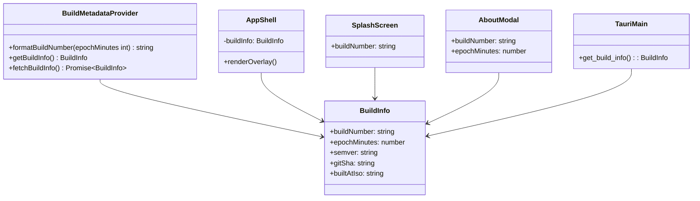
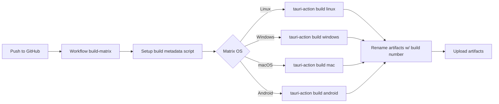

# Architecture Plan — Cross-Platform Build Automation — 2025-09-17 23:55 UTC

## Context & Baseline AST Snapshot

- `package.json`
  - Scripts: `dev`, `build`, `preview`, `lint`, `format` (npm).
  - Version `0.1.0`; React/Vite frontend dependencies, Tauri API.
- `vite.config.ts`
  - Defines global constants `__BUILD_EPOCH__`, `__BUILD_SEMVER__`, `__GIT_SHA__` using epoch seconds.
- `src/config/buildInfo.ts`
  - `getBuildInfo()` returns `{ epoch, semver, gitSha, builtAtIso }` (epoch seconds).
  - `fetchBuildInfo()` optionally augments via Tauri command `get_build_info`.
- `src/types/knowledge.ts`
  - `BuildInfo` type describing above shape.
- UI components consuming build info:
  - `AppShell.tsx` maintains build info state, shows About modal, splash, tooltip.
  - `SplashScreen.tsx` receives numeric `epoch` and renders "build {epoch}".
  - `AboutModal.tsx` lists version, build, commit, built time.
- `src-tauri/build.rs`
  - Emits `BUILD_EPOCH` (seconds) and `GIT_SHA` env vars at compile-time.
- `src-tauri/src/main.rs`
  - `get_build_info` command returns strings for epoch/semver/gitSha.
- `tauri.conf.json`
  - Bundles Linux (AppImage, deb), Windows (msi, nsis), macOS (dmg).
- Existing GitHub workflows: none in repo root currently (CI placeholders referenced in UUID index but absent locally).

## Goals

1. Introduce deterministic 5-character epoch-minute build number accessible across frontend, Tauri runtime, and GitHub Actions.
2. Surface build number in UI: splash screen, About modal, main window bottom-right, About tooltip metadata.
3. Automate GitHub builds on push using matrix across Linux, Windows, macOS, and Android, producing artifacts renamed to include build number (AppImage, deb, exe, msi, dmg, apk, etc.).
4. Ensure build metadata is embedded into artifact metadata (file names) and runtime `Help | About` information.

## Proposed AST Enhancements

### Build Metadata Core
- Extend `src/types/knowledge.ts`
  - Update `BuildInfo` to `{ buildNumber: string, epochMinutes: number, semver: string, gitSha: string, builtAtIso: string }`.
- Update `src/config/buildInfo.ts`
  - Compute canonical epoch-minute integer (`Math.floor(Date.now()/60000)`).
  - Derive 5-character base36 build number (upper-case, left-padded) to satisfy five-digit constraint.
  - Export helper `formatBuildNumber(epochMinutes: number): { buildNumber: string; epochMinutes: number }` for reuse.
  - `getBuildInfo()` returns new shape (uses Vite defines `__BUILD_MINUTES__`, `__BUILD_NUMBER__`).
  - `fetchBuildInfo()` merges new fields from Tauri command (`build_number`, `epoch_minutes`).
- Update `vite.config.ts`
  - Replace `epochSeconds()` with `epochMinutes()` and compute base36 build number.
  - Define new globals: `__BUILD_MINUTES__`, `__BUILD_NUMBER__`, rename `__BUILD_EPOCH__` usage accordingly while keeping backwards compatibility fallback for older UI (maybe still export `__BUILD_EPOCH__`?). We'll export both to avoid breakage.
- Update `src-tauri/build.rs`
  - Emit `BUILD_MINUTES` (integer minutes) and `BUILD_NUMBER` (5-char string) environment variables; maintain `BUILD_EPOCH` compatibility if needed (for fallback) using `minutes * 60`.
- Update `src-tauri/src/main.rs`
  - `BuildInfo` struct to include `buildNumber` and `epochMinutes` (strings) and embed existing fields.
  - `get_build_info` command returns new fields using environment variables.

### UI Integration
- `AppShell.tsx`
  - Adjust tooltip and string interpolation to show `buildInfo.buildNumber`.
  - Render persistent bottom-right overlay with version/build/sha.
  - Pass `buildInfo` to `SplashScreen` (prop shape change) and `AboutModal`.
- `SplashScreen.tsx`
  - Accept `buildNumber` (string) and optional `semver` to display.
- `AboutModal.tsx`
  - Present new build fields (build number, epoch minutes, git sha). Add labeling for readability.
  - Maybe show derived built time as before.

### Build Metadata Flow into Frontend
- Update `src/config/buildInfo.ts` to parse `__BUILD_MINUTES__`, `__BUILD_NUMBER__`, fallback to runtime default; ensure `builtAtIso` uses minutes.
- Provide `BUILD_NUMBER` etc for web fallback (when not defined) using same generation logic.

### GitHub Automation
- Add `.github/workflows/build-matrix.yml`
  - Trigger: push to main/any branch (per instructions: on every commit).
  - `env`: compute build minutes & number using Node script or inline JS, share via `echo "BUILD_NUMBER=..." >> $GITHUB_ENV`.
  - Jobs:
    - `linux`: `ubuntu-latest`, uses `tauri-apps/tauri-action@v0` with `targets: appimage deb` (maybe default). After build, rename artifacts to include `KG3D-Navigator_${buildNumber}_...`. Upload as workflow artifacts.
    - `windows`: `windows-latest`, build `msi`, `nsis`, `exe` (tauri bundler). rename & upload.
    - `macos`: `macos-latest`, build `dmg`. rename & upload.
    - `android`: `ubuntu-latest` or `macos-latest` (Android). Use `tauri-action` with `mobile-target: android` (if supported) or run `pnpm tauri android build`? Need to check. We'll plan to use `tauri-action` `targets: android` with required env (Java SDK). Provide caching steps.
  - Each job should install Node + Rust toolchains using actions.
  - Ensure `npm ci` run.
  - Provide job step to call `node scripts/compute-build-metadata.mjs` to output build minutes & number, writing to artifacts and environment.
  - Use `actions/upload-artifact` with custom names containing build number.

### Utility Script
- Add `scripts/compute-build-metadata.mjs`
  - Node script computing epoch minutes and base36 build number, writing JSON for reuse.
  - Accept optional `--output` path; default prints to stdout and writes `.build/build-metadata.json`? We'll define simple: prints `BUILD_MINUTES=...` etc for CI.
- Ensure script integrated in `package.json` (maybe `npm run build-metadata`).

### Documentation & Traceability
- Update `docs/CHECKLISTS` with new timestamped checklist referencing steps.
- Update `docs/UUID.md` with new entries for new script/workflow/build info if required by repo standard.
- If necessary, mention inability to update external hybrid knowledge graph; provide local note.

## UML / Mermaid Representations

### Build Metadata Flow (Class Diagram)

### CI Build Pipeline (Mermaid Flowchart)

## Hybrid Knowledge Graph Note
External hybrid knowledge graph services are not accessible within this execution environment; architecture metadata is recorded locally in this document to remain aligned with repository state.

