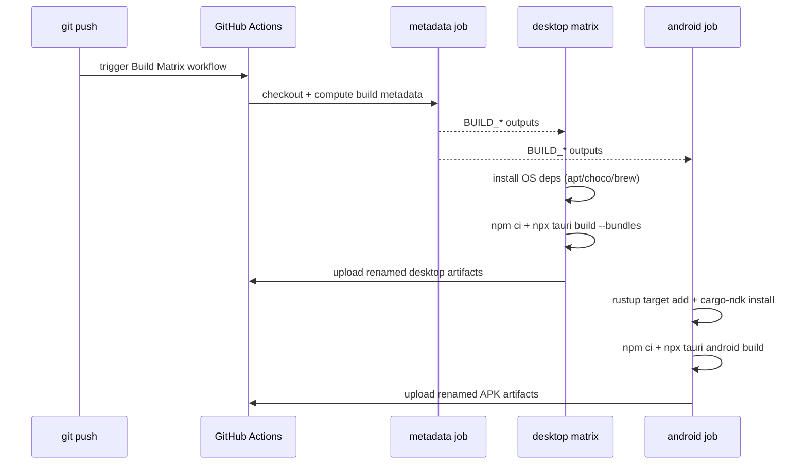

# Architecture: CI Build Readiness Hardening (2025-09-18 10:30 UTC)

## Context and Goals
- Recent GitHub Actions runs for `Build Matrix` fail before artifact packaging because host-specific prerequisites for Tauri desktop bundles (AppImage/deb/msi/dmg/nsis) and Android APKs are missing.
- Objective: harden the workflow so that the automation installs required toolchains, and document the manual prerequisites/secret provisioning path so the pipeline is reproducible.
- Scope: `.github/workflows/build-matrix.yml`, new operations runbook under `docs/operations/`, README pointer. No application runtime code changes.

## Current Repo Snapshot (High-Level AST Abstraction)
```
kg3dnav-cr/
├── .github/
│   └── workflows/
│       └── build-matrix.yml        # multi-job GitHub Action (metadata, desktop, android)
├── docs/
│   ├── architecture/               # architecture decision records & diagrams
│   ├── CHECKLISTS/                 # task breakdown logs
│   └── ...
├── scripts/
│   └── compute-build-metadata.mjs  # emits BUILD_* env vars for CI & local use
├── src-tauri/
│   ├── build.rs                    # bridges BUILD_* env vars into Rust env!() macro
│   └── src/main.rs                 # get_build_info command, metadata propagation
└── README.md                       # top-level getting started + metadata summary
```

## Delta Overview
- **Workflow Enhancements**: inject per-OS dependency steps prior to `npm ci` so that Linux (apt deps), Windows (WiX, NSIS), macOS (create-dmg), and Android (Rust targets + cargo-ndk) tooling exists when `npx tauri build` executes.
- **Documentation**: new runbook `docs/operations/ci-build-readiness-20250918.md` describing actionable steps, secrets, and local reproduction instructions; README links to the runbook for visibility.

## Mermaid Sequence (Workflow Overview)


## Component Interaction Notes
- `compute-build-metadata.mjs` remains the single source of build numbers; no code change required.
- Workflow environment variables (`BUILD_NUMBER`, etc.) continue to flow into `build.rs`/`main.rs` unchanged; additions are pre-build system packages only.
- Documentation additions ensure human operators know how to mirror the automated setup or diagnose missing dependencies.

## Risks and Mitigations
- **Longer CI time**: extra package installs add minutes; mitigate by caching where possible and scoping installs to OS-specific conditionals.
- **Homebrew/choco availability**: rely on hosted runner defaults; documented fallback commands in runbook.
- **Android signing**: runbook will clarify debug vs release builds and required secrets for release.

## Deliverables
1. Updated `.github/workflows/build-matrix.yml` with dependency steps (`Install Linux prerequisites`, `Install Windows tooling`, `Install macOS dmg tooling`, `Configure Android Rust targets`).
2. New `docs/operations/ci-build-readiness-20250918.md` (includes table of dependencies, secrets checklist, local reproduction script excerpt).
3. README addition pointing to the runbook for CI troubleshooting.

