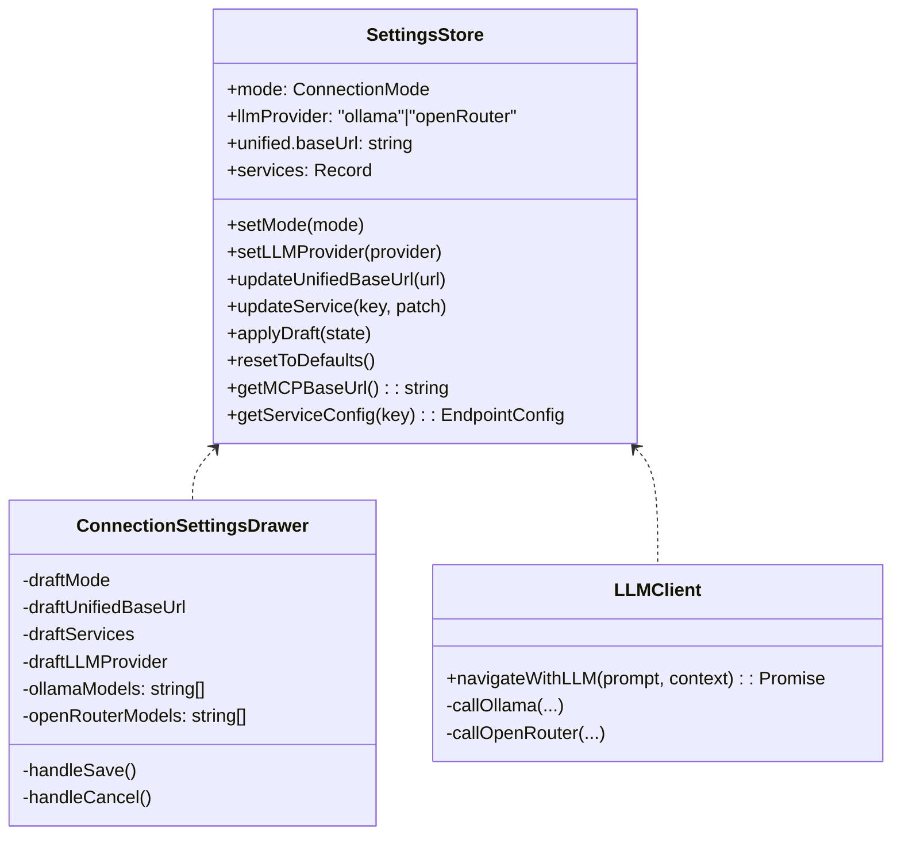
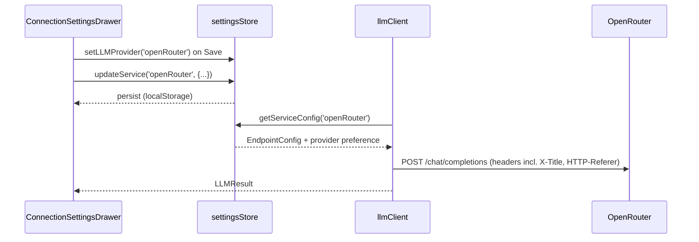

# Architecture — Config Sidebar & LLM Defaults (2025-09-27 19:55 UTC)

## Repository Context Snapshot
- **Front-end**: React + TypeScript (Vite) under `src/`
  - `components/` — UI layout, including `ConnectionSettingsDrawer` for cogwheel sidebar.
  - `services/` — client utilities (`llmClient.ts` orchestrates LLM calls).
  - `state/` — Zustand stores including `settingsStore.ts` persisting endpoint config.
  - `config/buildInfo.ts` — runtime build metadata fetch/format helpers.
- **Desktop shell**: Tauri Rust crate under `src-tauri/` exposing `get_build_info` command.
- **Tooling**: `scripts/compute-build-metadata.mjs` emits build env vars during CI.

## Target Feature Architecture (AST-style Outline)
```
ConnectionSettingsDrawer (React.FC)
├─ Local state
│  ├─ activeTab: 'connections' | 'llm'
│  ├─ revealApiKey: boolean
│  ├─ draftMode: ConnectionMode
│  ├─ draftUnifiedBaseUrl: string
│  ├─ draftServices: Record<ServiceKey, EndpointConfig>
│  ├─ llmModelOptions: {
│       ollama: string[]
│       openRouter: string[]
│       status: 'idle' | 'loading' | 'error'
│       error?: string
│     }
│  ├─ selectedLLMProvider: 'ollama' | 'openRouter'
├─ Effects
│  ├─ sync store snapshot into drafts on open / cancel
│  ├─ fetchModels(provider)
│       ├─ GET {baseUrl}/api/tags (Ollama / OpenAI-compatible)
│       ├─ map to string identifiers, dedupe
│       ├─ update combo-box datalist values
├─ Render
│  ├─ Radio to toggle draftMode (unified vs per service)
│  ├─ Unified MCP base URL input (draft)
│  ├─ Service cards when perService
│     ├─ Each card renders text/password inputs for:
│         • baseUrl, username, password, apiKey, model,
│         • database (neo4j/postgres),
│         • collection + dimension + embeddingModel (qdrant)
│  ├─ LLM tab
│     ├─ Provider radio (Ollama vs OpenAI-compatible)
│     ├─ Combo-box inputs bound to datalist (with manual typing support)
│  ├─ Footer buttons: Reset Defaults, Cancel (revert drafts), Save (persist drafts to store)
│
├─ Actions
│  ├─ saveDrafts → settingsStore.bulkUpdate(draftMode, draftUnifiedBaseUrl, draftServices, provider)
│  ├─ cancelDrafts → revert to store snapshot
```

```
settingsStore (Zustand)
├─ State shape additions
│  ├─ llmProvider: 'ollama' | 'openRouter'
│  ├─ services[neo4j].database?: string (default 'neo4j')
│  ├─ services[postgres].database?: string (default 'maindb')
│  ├─ services[qdrant]
│      ├─ collection?: string (default 'hkg-2sep2025')
│      ├─ embeddingModel?: string (default 'mxbai-embed-large')
│      ├─ dimension?: number (default 1024)
├─ Actions
│  ├─ bulkUpdate(payload)
│  ├─ updateService handles new numeric/string fields
│  ├─ resetToDefaults resets llmProvider + new defaults
│  ├─ getServiceConfig ensures sanitized defaults for new fields
```

```
llmClient
├─ sanitizeUrl fallback updates (Ollama → http://localhost:11434)
├─ use settingsStore snapshot for llmProvider
├─ navigateWithLLM
│  ├─ primary provider = store.llmProvider
│  ├─ secondary = opposite
│  ├─ callOpenRouter attaches headers:
│      X-Title: "Hybrid Knowledge Graph (Robin L. M. Cheung, MBA) v0.1a"
│      HTTP-Referer: "https://hkg.robincheung.com"
│  ├─ baseUrl default `https://openrouter.ai/api/v1/chat/completions`
│  ├─ compute fetch URL by trimming `/chat/completions` before appending when necessary
```

```
buildInfo.ts
├─ extend BuildInfo with versionBuild string
├─ computeVersionBuild(semver, epochSeconds)
│  ├─ parse major/minor from semver
│  ├─ timestampSeed = Math.floor(epochSeconds / 100) % 10000
│  ├─ return `v${major}.${minor.padStart(2,'0')}${seed.padStart(4,'0')}`
├─ include fallback when constants absent
├─ fetchBuildInfo merges Tauri payload w/ computed versionBuild
```

```
src-tauri::main.rs
├─ BuildInfo struct gains version_build field
├─ get_build_info computes version_build using same algorithm
│  ├─ major/minor parsed from env!("CARGO_PKG_VERSION")
│  ├─ timestamp from BUILD_EPOCH or current time
```

```
scripts/compute-build-metadata.mjs
├─ derive versionBuild from package.json version + Date.now()
├─ emit VERSION_BUILD env + JSON entry
```

## Mermaid Diagram


## Mermaid Sequence (LLM selection)


## Open Questions / External Systems
- Hybrid knowledge graph sync: no direct Neo4j/Qdrant/Postgres connectivity in this environment; manual synchronization required post-commit.
- `/api/tags` availability for OpenRouter assumed; fallback gracefully handles failures with combo-box manual entry.
