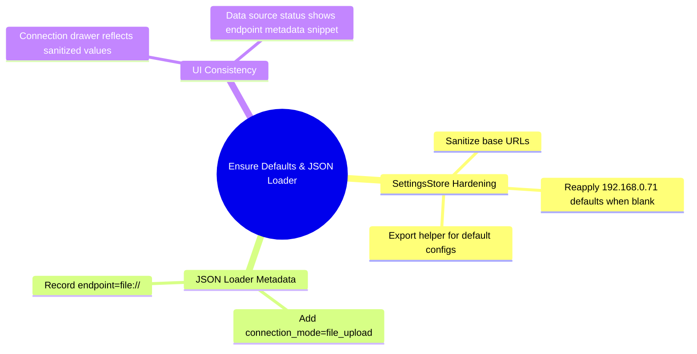

# Architecture Plan — HKG Defaults & JSON Loader Verification (2025-09-26 13:56 UTC)

## Context & Baseline Repository Abstraction
- **State Management**
  - `src/state/settingsStore.ts`
    - Zustand store managing connection mode (`unified` vs `perService`).
    - Service configs keyed by `ServiceKey` (Neo4j, Qdrant, PostgreSQL, Ollama, OpenRouter).
    - Persisted to `localStorage`; exposes selectors (`useSettingsMode`, `useUnifiedBaseUrl`, `useServiceMap`).
  - `src/state/store.ts`
    - Primary app state (entities, edges, layout, selection, UI flags).
- **Services**
  - `src/services/hkgLoader.ts`
    - Fetchers for MCP/unified services, typed metadata, heuristics for selecting endpoints.
  - `src/services/jsonGraphLoader.ts`
    - Validates uploaded JSON graphs, coercing entity/relationship structures.
  - `src/services/llmClient.ts`
    - Invokes Ollama (default `http://192.168.0.71:11434`) and falls back to OpenRouter (`x-ai/grok-4-fast:free`).
- **UI Components**
  - `src/components/DataSourcePanel.tsx`
    - Source selector (Neo4j/Qdrant/Postgres/JSON upload) and orchestrates loads via services.
  - `src/components/ConnectionSettingsDrawer.tsx`
    - Cogwheel drawer for configuring endpoints/auth per service or unified MCP base.
  - `src/components/AINavigationChat.tsx`
    - Chat interface invoking heuristic entity ranking and `navigateWithLLM` fallback pipeline.

### Repository AST Overview (Key Modules)
```
repo
└── src
    ├── state
    │   ├── settingsStore.ts
    │   └── store.ts
    ├── services
    │   ├── hkgLoader.ts
    │   ├── jsonGraphLoader.ts
    │   └── llmClient.ts
    └── components
        ├── DataSourcePanel.tsx
        ├── ConnectionSettingsDrawer.tsx
        └── AINavigationChat.tsx
```

### Current Alignment with Hybrid Knowledge Graph
- Latest repo defaults already point to `192.168.0.71`, but blank inputs can persist as empty strings, bypassing fallbacks.
- JSON loader sets metadata yet omits explicit `connection_mode` to signal file uploads.
- Unable to sync to shared Neo4j hybrid graph (host unreachable from sandbox); note for follow-up after connectivity returns.

## Proposed Enhancements
1. **Hardening Default Endpoint Fallbacks**
   - Sanitize and normalize unified and per-service base URLs in `settingsStore.ts`.
   - Reapply service-specific defaults (`192.168.0.71` host) whenever values are cleared.
   - Expose helper to retrieve immutable default configs and use within getters.
2. **Metadata Clarity for JSON Imports**
   - Extend `loadGraphFromJsonFile` metadata with `connection_mode: 'file_upload'` and `endpoint` describing uploaded source.
3. **UI Feedback Consistency**
   - Ensure `ConnectionSettingsDrawer` reflects sanitized defaults immediately after reset/cleared inputs.
   - Surface metadata summary in `DataSourcePanel` after JSON/HKG loads to confirm which endpoint responded (leveraging existing status panel).

## UML Component Relationships
```mermaid
classDiagram
    class SettingsStore {
        +mode: ConnectionMode
        +unified.baseUrl: string
        +services: Record<ServiceKey, EndpointConfig>
        +setMode()
        +updateUnifiedBaseUrl()
        +updateService()
        +resetToDefaults()
        +getMCPBaseUrl()
        +getServiceConfig()
    }
    class ConnectionSettingsDrawer {
        +props: { isOpen, onClose }
        +renders fields per ServiceKey
        +invokes SettingsStore actions
    }
    class DataSourcePanel {
        +load(source)
        +handleJsonFile(file)
        +status map
    }
    class JsonGraphLoader {
        +parseKnowledgeGraphJson()
        +loadGraphFromJsonFile()
    }
    class HkgLoader {
        +loadFromHKG()
        +searchShardedHKG()
        +loadByEntityType()
    }
    class LlmClient {
        +navigateWithLLM()
        +callOllama()
        +callOpenRouter()
    }
    class AINavigationChat {
        +send()
        +processNavigationRequest()
    }

    ConnectionSettingsDrawer --> SettingsStore
    DataSourcePanel --> SettingsStore : (via services)
    DataSourcePanel --> HkgLoader
    DataSourcePanel --> JsonGraphLoader
    AINavigationChat --> LlmClient
    LlmClient --> SettingsStore
```

## Mermaid Mindmap of Implementation Steps


## Acceptance Criteria
- Clearing any endpoint field and blurring should revert to its 192.168.0.71 default upon next read.
- JSON upload metadata includes `connection_mode: 'file_upload'` and `endpoint` referencing the uploaded file.
- Status panel shows last load metadata with endpoint string so operators confirm the active source.
- LLM navigator continues to call Ollama first (`http://192.168.0.71:11434`), then OpenRouter `openrouter/x-ai/grok-4-fast:free`.

## Hybrid Knowledge Graph Sync Plan
- After code updates, re-export architecture/checklist to Neo4j instance tagged with project UUID once network to `192.168.0.71` is available. Logged as follow-up.
