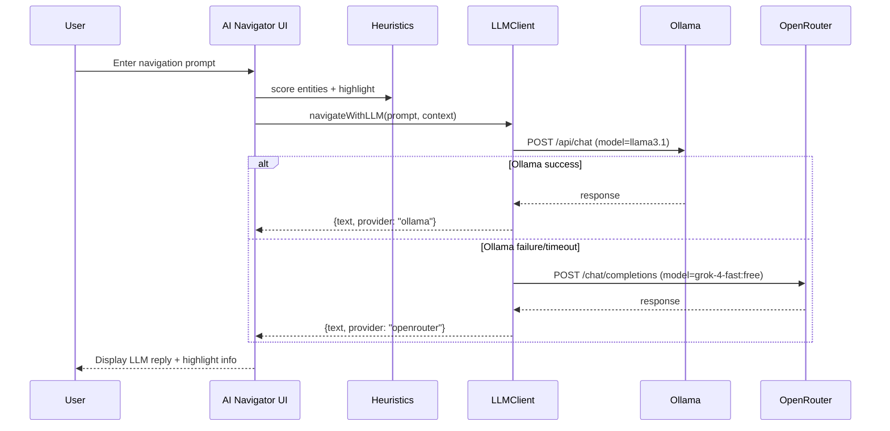

# Architecture: HKG Endpoint Defaults & LLM Navigator Integration (2025-09-26 13:16 UTC)

## Context and Goals
- Ensure every data acquisition path (Neo4j, Qdrant, PostgreSQL, unified hKG MCP) defaults to host **192.168.0.71** while remaining user-configurable.
- Restore "Load graph from JSON" capability inside the data source panel, including validation and surface status feedback when a JSON knowledge graph is uploaded.
- Upgrade the AI Navigator chat so that it can call out to **Ollama** first (on the same 192.168.0.71 host) and fall back to **OpenRouter → x-ai/grok-4-fast:free**, blending LLM guidance with existing entity-highlighting behaviors.
- Surface a cogwheel settings drawer that centralizes connection configuration (unified vs per-service) and LLM credentials, persisted locally for repeat sessions.
- Note: external hybrid knowledge graph synchronization endpoints are not available in this execution environment; plan includes a stub step documenting how the architecture would be written back when connectivity exists.

## Current Repo Snapshot (High-Level AST Abstraction)
```
kg3dnav-cr/
├── docs/
│   ├── architecture/                     # ADRs, diagrams
│   ├── CHECKLISTS/                       # Task breakdowns
│   └── ...
├── src/
│   ├── components/
│   │   ├── AppShell.tsx                  # top-level shell wiring Canvas3D + Sidebar + panels
│   │   ├── DataSourcePanel.tsx           # data source selection, options, status badges
│   │   ├── AINavigationChat.tsx          # heuristic navigator chat (no LLM outbound today)
│   │   └── ...
│   ├── config/
│   │   └── env.ts                        # exposes HKG_MCP_BASE_URL (localhost default)
│   ├── services/
│   │   ├── hkgLoader.ts                  # fetch helpers for neo4j/qdrant/postgres via MCP
│   │   └── layoutEngine.ts               # 3D placement
│   ├── state/
│   │   ├── store.ts                      # zustand store for graph + UI state
│   │   └── actions.ts                    # UI action creators
│   └── types/
│       └── knowledge.ts                  # Entity/Relationship typings
├── index.html / main.tsx                 # React entry
└── src-tauri/                            # Desktop bridge (unchanged by this feature)
```

## Proposed Changes Overview
1. **Connection Settings Layer**
   - New `state/settingsStore.ts` (Zustand + `persist`) capturing:
     - `mode: 'unified' | 'perService'`
     - `unified.baseUrl` (default `http://192.168.0.71:49160`)
     - Per-service endpoints/credentials: `neo4j`, `qdrant`, `postgres`, `ollama`, `openRouter`.
     - `openRouter.apiKey` persisted securely (localStorage key, redacted in UI once saved).
   - Selector helpers: `getMCPBaseUrl()`, `getServiceUrl('neo4j')`, etc., consumed by loaders & LLM client.

2. **Cogwheel Settings Drawer**
   - New `components/ConnectionSettingsDrawer.tsx` rendered from `AppShell` as floating cog button.
   - Supports tabs (`Connection`, `LLM`), toggles unified/per-service, input validation, and "Reset to defaults" (reverts to 192.168.0.71).
   - Visual state: overlay similar to other panels, accessible toggled state stored locally (non-persisted UI flag in drawer component).

3. **Data Source Panel Enhancements**
   - Introduce JSON upload UI (visible when FILE source active): file drop zone + hidden input.
   - Parse using new helper `services/jsonGraphLoader.ts` (`loadGraphFromJsonFile(file)` → `KnowledgeGraphResult`), with schema validation (entities array with `name`, `type`; relationships with `source`, `target`).
   - Provide status updates (success/error) within panel, leveraging existing `status` map.
   - Add quick link/button to open cogwheel drawer for connection edits.

4. **HKG Loader Wiring**
   - Update `services/hkgLoader.ts` to source base URLs from `settingsStore` instead of static env default; fallback retains env for legacy use.
   - Extend `findWorkingMCPServer()` candidate list to prioritise `settingsStore.getState().unified.baseUrl` (192.168.0.71 default) before localhost.
   - When `mode === 'perService'`, route Neo4j/Qdrant/PostgreSQL requests directly to provided endpoints (bypassing MCP), but still support unified fallback. (Implementation: conditional fetch using service-specific URL + path heuristics, with TODO to align with service API expectations.)

5. **LLM Client Service**
   - New `services/llmClient.ts` exposing `navigateWithLLM(prompt, context)`:
     1. Compose system prompt summarizing top entities (limited list) + user message.
     2. Attempt Ollama: `POST ${ollamaUrl}/api/chat` with model `llama3.1` (configurable) -> parse `message.content`.
     3. If Ollama fails/timeouts, call OpenRouter `https://openrouter.ai/api/v1/chat/completions` with model `openrouter/x-ai/grok-4-fast:free`, using API key from settings.
     4. Return text + optionally extracted entity suggestions (via regex/JSON request instructions).

6. **AI Navigation Chat Update**
   - Replace purely local heuristic response with pipeline:
     - Keep entity keyword scoring to highlight nodes.
     - Call `navigateWithLLM` for narrative guidance; merge highlight results with LLM text.
     - Display provider badges (Ollama/OpenRouter) and handle streaming indicator.
     - Expose error states gracefully while maintaining heuristics fallback.

7. **Documentation & Graph Sync Hooks**
   - Note architecture + checklist in `docs/` (this file & new checklist).
   - Add short operations note inside architecture describing future HKG sync invocation stub (`scripts/sync-hkg-architecture.mjs` placeholder note) since environment lacks connectivity.

## Mermaid Class Diagram (New Settings & Service Integration)
```mermaid
classDiagram
    class SettingsStore {
        +mode: 'unified' | 'perService'
        +unified: { baseUrl: string }
        +services: { neo4j: Endpoint; qdrant: Endpoint; postgres: Endpoint; ollama: Endpoint; openRouter: { baseUrl: string; apiKey?: string; model: string } }
        +getMCPBaseUrl(): string
        +getServiceUrl(name): string
    }
    class HKGLoader {
        +findWorkingMCPServer()
        +loadFromNeo4j(opts)
        +loadFromQdrant(query)
        +loadFromPostgreSQL()
        +loadFromHKG(source)
    }
    class LLMClient {
        +navigateWithLLM(prompt, context): Promise<LLMResult>
        -callOllama()
        -callOpenRouter()
    }
    class DataSourcePanel {
        -handleJsonUpload(File)
        -openSettings()
    }
    class ConnectionSettingsDrawer {
        -modeToggle
        -inputFields
    }
    SettingsStore --> HKGLoader
    SettingsStore --> LLMClient
    SettingsStore --> ConnectionSettingsDrawer
    LLMClient --> AINavigationChat
    DataSourcePanel --> SettingsStore
    DataSourcePanel ..> jsonGraphLoader
```

## Mermaid Sequence (AI Navigation Flow)


## Risks & Considerations
- **Endpoint Variability**: Actual Neo4j/Qdrant/Postgres HTTP APIs may diverge from MCP contract; initial implementation focuses on unified MCP path with per-service overrides marked experimental.
- **Credential Storage**: LocalStorage persistence means secrets live in browser storage; add warnings and allow quick clearing.
- **LLM Latency/Failures**: Provide UI spinner and fallback heuristics so navigation remains usable when LLM unreachable.
- **File Upload Validation**: Strict schema checks necessary to avoid crashing renderer; guard with try/catch and user-friendly error.

## Deliverables
1. `state/settingsStore.ts`, `services/jsonGraphLoader.ts`, `services/llmClient.ts` (new).
2. Updated `services/hkgLoader.ts`, `config/env.ts`, `components/AppShell.tsx`, `components/DataSourcePanel.tsx`, `components/AINavigationChat.tsx` to wire settings, JSON upload, and LLM integration.
3. New `components/ConnectionSettingsDrawer.tsx` cogwheel UI (plus styles and open button in AppShell/DataSourcePanel).
4. Documentation updates (this architecture, checklist under `docs/CHECKLISTS/`).
5. Placeholder note for future hybrid knowledge graph sync invocation (documented).
