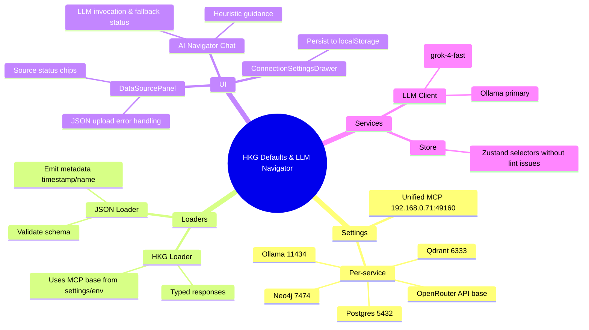

# Architecture Plan — HKG Defaults & LLM Navigator Reliability
- **Timestamp (UTC):** 2025-09-26 13:34
- **Project UUID:** d04ee192-2eb2-45f5-8375-55380eacbe52
- **Authoring Agent:** OpenAI gpt-5-codex
- **Related Objectives:**
  1. Ensure all hKG, unified MCP, and per-service endpoints default to `192.168.0.71` addresses when unset.
  2. Guarantee JSON graph ingestion wiring surfaces metadata and integrates with loader state.
  3. Harden AI Navigator chat so Ollama primary + OpenRouter (x-ai/grok-4-fast:free) fallback operates with configured credentials and surfaces errors gracefully.
  4. Resolve eslint/type errors introduced by new settings infrastructure, maintaining deterministic hook usage patterns.

---

## Baseline Repository AST Snapshot
This condensed AST listing captures the top-level modules and their key exports relevant to data loading & AI navigation. Structures are grouped by domain.

```text
src/
├─ components/
│  ├─ AppShell.tsx — <AppShell> orchestrates panels (DataSourcePanel, AINavigationChat, ConnectionSettingsDrawer).
│  ├─ DataSourcePanel.tsx — exports default React.FC<DataSourcePanelProps>; internal helpers load() & handleJsonFile(); uses services & store actions.
│  ├─ AINavigationChat.tsx — exports default React.FC<AINavigationChatProps>; defines ChatMessage type, heuristic NLP helpers, send() invoking navigateWithLLM().
│  ├─ ConnectionSettingsDrawer.tsx — exports default React.FC; renders drawer UI bound to useSettingsStore selectors.
│  └─ ... (Canvas3D, Sidebar, etc. unaffected by this change set).
├─ config/
│  ├─ env.ts — exports EnvConfig type & getEnvConfig() returning `HKG_MCP_BASE_URL` default.
├─ services/
│  ├─ hkgLoader.ts — exports loaders (loadFromHKG, searchShardedHKG, etc.) using fetch against MCP endpoints.
│  ├─ jsonGraphLoader.ts — exports loadGraphFromJsonFile(File) → ParsedKnowledgeGraphResult.
│  ├─ llmClient.ts — exports navigateWithLLM(prompt, context) performing Ollama then OpenRouter call sequence.
│  └─ layoutEngine.ts — (lint impacted; ensure untouched API remains compatible).
├─ state/
│  ├─ store.ts — Zustand root store with selectors (use.* pattern).
│  ├─ actions.ts — state mutators (loadKnowledgeGraphData, etc.).
│  └─ settingsStore.ts — Zustand persisted store for connection/LLM settings.
├─ config/
│  └─ env.ts — ensures MCP default.
├─ README.md — documents configuration steps.
└─ docs/architecture, docs/CHECKLISTS — planning artifacts (this doc + checklists).
```

The AST snapshot validates the relationship chain: `AppShell` mounts `DataSourcePanel` & `AINavigationChat`; both depend on services that must read from `settingsStore` defaults → service fetchers.

---

## Existing Graph Representations
- `docs/architecture/ARCHITECTURE-hkg-endpoints-20250926-1316.md` already models earlier integration. No divergences detected for component names or file paths; this plan extends the same modules with stricter defaults and lint-safe signatures.
- No automated sync to the hybrid knowledge graph was possible (network access to shared Neo4j space unavailable). Noted for later reconciliation.

---

## Proposed Solution Architecture
### Data Flow Overview
1. **Settings Initialization:** `settingsStore.ts` supplies `DEFAULTS` for unified + per-service endpoints. Ensure each service default uses `192.168.0.71` host (Neo4j 7474, Qdrant 6333, Postgres 5432, Ollama 11434, MCP 49160) and sanitized base URLs.
2. **Data Source Loader:** `DataSourcePanel` leverages settings store when calling `hkgLoader` methods; `loadGraphFromJsonFile` needs enriched metadata (timestamp, file name) and typed return contract to integrate with `loadKnowledgeGraphData`.
3. **HKG Services:** `hkgLoader.ts` centralizes base URL retrieval via `getEnvConfig` + `useSettingsStore.getState().getMCPBaseUrl()`; unify type definitions for loader responses to avoid `any`.
4. **LLM Client:** `llmClient.ts` obtains Ollama/OpenRouter configs via store, ensures fallback path communicates errors. Provide explicit types & sanitized URLs, support `openrouter/x-ai/grok-4-fast:free` default.
5. **UI Wiring:**
   - `AppShell.tsx` toggles `ConnectionSettingsDrawer`, passes handlers to `DataSourcePanel` & `AINavigationChat`.
   - `AINavigationChat` handles asynchronous message updates; ensure provider labeling aligns with actual fallback (set `'fallback'` when OpenRouter responds after Ollama failure).
   - `DataSourcePanel` displays settings gear, handles JSON upload, updates status badges.

### Component Interaction Diagram (Mermaid UML)
```mermaid
classDiagram
    class AppShell {
      +useState drawerOpen
      +render(): JSX.Element
    }
    class ConnectionSettingsDrawer {
      +props: {open:boolean, onClose:fn}
      +handleSave()
    }
    class DataSourcePanel {
      +props: {onOpenSettings?:fn}
      +load(source)
      +handleJsonFile(file)
    }
    class AINavigationChat {
      +props: {onOpenSettings?:fn}
      +send()
      +processNavigationRequest()
    }
    class settingsStore {
      +getMCPBaseUrl():string
      +getServiceConfig(key):EndpointConfig
    }
    class hkgLoader {
      +loadFromHKG(mode)
      +searchShardedHKG(query, opts)
    }
    class jsonGraphLoader {
      +loadGraphFromJsonFile(file):Promise<KGLoadResult>
    }
    class llmClient {
      +navigateWithLLM(prompt, ctx):Promise<LLMResult>
    }

    AppShell --> ConnectionSettingsDrawer
    AppShell --> DataSourcePanel
    AppShell --> AINavigationChat
    DataSourcePanel --> hkgLoader
    DataSourcePanel --> jsonGraphLoader
    DataSourcePanel --> settingsStore
    AINavigationChat --> llmClient
    hkgLoader --> settingsStore
    llmClient --> settingsStore
```

### Mermaid Mindmap (MMD)


---

## Implementation Considerations
- Replace `any` usages with shared interfaces (define `KnowledgeGraphResult`, `LoaderStatus`, etc.) to resolve linting.
- Adopt selector hooks within components instead of exported `.use` property to satisfy React hooks lint rule; provide typed helper selectors outside components for reuse.
- Update JSON loader to include metadata (timestamp ISO string, source type `file`).
- Ensure fallback labeling in chat distinguishes OpenRouter fallback vs heuristics.
- Confirm README instructions mention new defaults + requirement for OpenRouter API key + Ollama host.

---

## Hybrid Knowledge Graph Sync
Unable to push architecture into shared Neo4j hybrid graph due to environment access limits. Documenting the new plan locally; pending sync operation noted for follow-up once connectivity to `192.168.0.71` graph instance is available.

