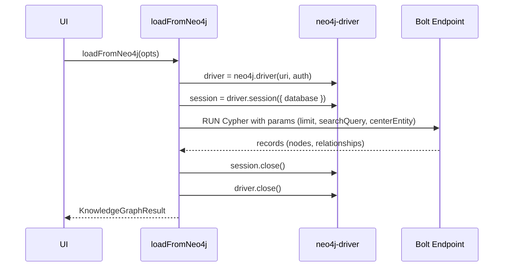

# Architecture: Neo4j Bolt Connectivity & Build Banner Simplification (2025-09-27 21:12:10 UTC)

## Context & Objective
- Observed: Neo4j fetch path authenticates via HTTP REST MCP proxy, preventing Bolt-native auth and graph retrieval.
- Observed: Bottom-right build badge shows redundant legacy line (`build HGCZ8 • sha unknown • minutes 29316788`) beneath the accurate semantic version/build.
- Goal: Replace HTTP proxy usage with direct Bolt (port 7687) connections using official Neo4j JavaScript driver while preserving entity/relationship normalization; trim redundant build banner line.
- Dependencies: `src/services/hkgLoader.ts`, `src/state/settingsStore.ts`, `src/components/AppShell.tsx`, `package.json` (for driver dependency).
- Constraint: Hybrid Knowledge Graph (hKG) external endpoints remain unreachable from sandbox; architecture/checklist stored locally with note to sync once connectivity exists.

## Current Repo Snapshot (Focused AST Overview)
```text
kg3dnav-cr/
├── package.json                 # dependency manifest (no neo4j-driver)
├── src/
│   ├── services/
│   │   └── hkgLoader.ts         # loadFromNeo4j uses HTTP fetch -> MCP `/mcp/neo4j/read_graph`
│   ├── state/
│   │   └── settingsStore.ts     # DEFAULT_SERVICE_ENDPOINTS.neo4j = http://192.168.0.71:7474
│   └── components/
│       └── AppShell.tsx         # Renders build badge (two-line stack) & orchestrates loaders
└── docs/
    ├── architecture/            # ADR history
    └── CHECKLISTS/              # Execution breakdowns
```

## Proposed Modifications
1. **Introduce Bolt Driver Connectivity**
   - Add `neo4j-driver` dependency.
   - Update `settingsStore.ts` defaults to `bolt://192.168.0.71:7687`; keep username/password/database fields.
   - In `hkgLoader.ts`, replace fetch-based Neo4j branch with Bolt session workflow:
     - Parse Bolt URI from settings (per-service or default) and credentials.
     - Establish driver (`neo4j.driver(uri, auth.basic(username, password), { disableLosslessIntegers: true })`).
     - Run Cypher tailored to requested options:
       ```
       MATCH (n)
       WHERE ($entityTypes IS NULL OR labels(n)[0] IN $entityTypes)
         AND ($searchQuery IS NULL OR toLower(n.name) CONTAINS toLower($searchQuery))
       WITH n LIMIT $limit
       OPTIONAL MATCH (n)-[r]-(m)
       RETURN collect(DISTINCT n) AS nodes,
              collect(DISTINCT { from: startNode(r).name, to: endNode(r).name, relationType: type(r), uuid: r.uuid }) AS rels,
              size(nodes) AS totalCount
       ```
     - Map nodes/relationships into existing normalization helpers; ensure fallback to metadata-enriched path (limit/centerEntity handled via parameters, `maxConnections` restricting relationships).
     - Guarantee driver/session close in `finally` to avoid resource leaks.
     - Preserve `loadFromHKG`/`loadByEntityType` semantics by delegating to new Bolt-powered loader.

2. **Simplify Build Badge**
   - Remove second `<div>` in `AppShell.tsx` badge so only formatted version/build row remains.

3. **Documentation & Knowledge Graph Sync Note**
   - Record architecture (this file) & checklist; note inability to push to remote hKG due to access limits.

## UML / Mermaid Representation

### Class Diagram (Neo4j Loader Integration)
```mermaid
classDiagram
    class SettingsStore {
        +services.neo4j: { baseUrl: string, username?: string, password?: string, database?: string }
        +getState(): SettingsState
    }
    class HKGLoader {
        +loadFromNeo4j(options): Promise<KnowledgeGraphResult>
        -createNeo4jDriver(config): Driver
        -runNeo4jQuery(driver, options): Promise<RawNeo4jGraph>
    }
    class Neo4jDriver {
        +session(database): Session
        +close()
    }
    SettingsStore --> HKGLoader : supplies config
    HKGLoader --> Neo4jDriver : instantiates & executes Cypher
```

### Sequence Diagram (Bolt Query Lifecycle)


## Data Mapping Strategy
- Nodes: Expect `name`, `uuid`, `type` (label or property). Map to `Entity` by inspecting label priority (`labels(n)[0]`) with fallback to `properties.entityType` → `normalizeEntityType`.
- Relationships: Provide `source`/`target` via node names; include `uuid` when property exists.
- Metadata: maintain limit, offset, entity counts, connection mode, endpoint URI used.

## Knowledge Graph Synchronization Plan
- Intended: Push architecture/checklist documents into shared hKG via provided Neo4j/Postgres/Qdrant endpoints using project UUID.
- Status: Not executed — outbound connections to `mcp.robinsai.world` blocked (see `docs/operations/hkg-sync-20250927.md`). Action item logged to sync once connectivity restored.

