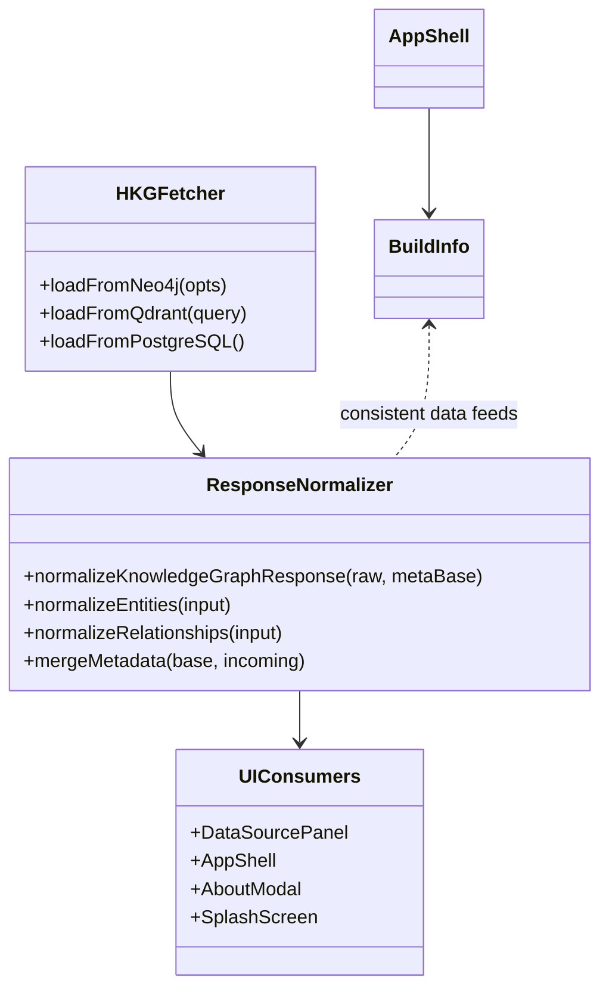
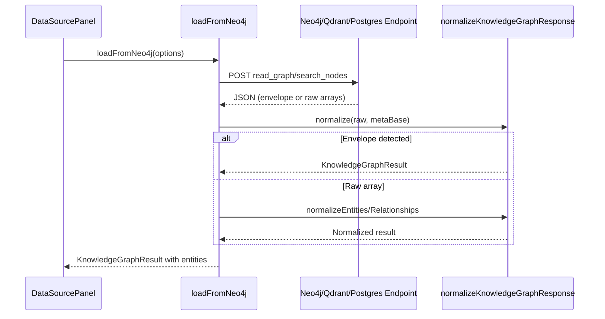

# Architecture: Version Build Formatting & HKG Direct Source Normalization (2025-09-27 20:18 UTC)

## Hybrid Knowledge Graph Sync Status
- Attempted to reach unified MCP health endpoint `http://mcp.robinsai.world:49160/health` — connection refused within the execution environment.
- Attempted to reach service-specific host `http://mcp.robinsai.world:7474` — connection refused.
- Conclusion: unable to pull or write architecture metadata to the remote hybrid knowledge graph because outbound network access is blocked here. Documenting the plan locally and flagging it for later synchronization once connectivity is restored.

## Current Repo Snapshot (Focused AST Abstract)
```
kg3dnav-cr/
├── src/
│   ├── components/
│   │   ├── AppShell.tsx            # Renders footer build info, uses BuildInfo.versionBuild
│   │   ├── AboutModal.tsx          # Displays BuildInfo metadata including versionBuild
│   │   └── SplashScreen.tsx        # Shows BuildInfo strings during splash
│   ├── config/
│   │   └── buildInfo.ts            # Computes build metadata; computeVersionBuild() formats string
│   ├── services/
│   │   └── hkgLoader.ts            # Fetch logic for Neo4j/Qdrant/Postgres + sharded searches
│   └── types/
│       └── knowledge.ts            # Defines BuildInfo, Entity, Relationship types
├── docs/
│   ├── architecture/               # Prior ADRs; we add new plan here
│   └── CHECKLISTS/                 # Execution checklists per feature
└── ...
```

Key observations:
- `computeVersionBuild` currently derives `bucket` via `Math.floor(epochSeconds / 100) % 10000` and concatenates without an explicit separator, producing `v1.038083` style strings regardless of runtime context.
- UI components render `buildInfo.versionBuild` verbatim; footer expects a human-friendly dotted form.
- `hkgLoader.ts` consumes service responses assuming they return raw arrays (`entities`, `relationships`). Actual MCP / direct service calls can respond with a full `{ knowledge_graph: { ... }, metadata: { ... } }` envelope, triggering "no data" statuses despite valid payloads.

## Problem Statement
1. **Version Build Format** — Align runtime formatting with canonical expectation `v{major}.{minor:02d}{bucket:04d}` derived from `int(time.time()) // 100`, and expose a dotted presentation `vX.YY.ZZZZ` in UI surfaces.
2. **Direct Service Connectivity** — When connecting to dedicated Neo4j, Qdrant, or PostgreSQL endpoints, normalize either envelope (`knowledge_graph`) or raw-array responses so the UI always materializes entity/relationship data instead of showing `no_data`.

## Proposed Solution Outline
### Build Info Formatting
- Update `computeVersionBuild(semver, epochSeconds)` to:
  - Extract `major`, `minor`.
  - Compute `bucket = Math.floor(Date.now() / 1000 / 100) % 10000` when explicit epoch missing, mirroring Python snippet `f"v{major}.{minor:02d}{...:04d}"`.
  - Return `v{major}.{minorPadded}{bucketPadded}`; derive dotted variant lazily in UI via helper `formatVersionBuildForDisplay(versionBuild)` → `versionBuild.replace(/^(v\d+\.\d{2})(\d{4})$/, '$1.$2')`.
- Ensure `getBuildInfo` and `fetchBuildInfo` produce both canonical and display-friendly strings (adding `versionBuildDisplay` on-the-fly before rendering).

### HKG Loader Normalization
- Introduce helper utilities in `hkgLoader.ts`:
  - `isPlainObject`, `normalizeEntities(input)`, `normalizeRelationships(input)` — accept either typed `Entity` or raw records with `entityType`/`relationType`.
  - `mergeMetadata(base, incoming)` to overlay server-provided metadata onto local defaults while preserving counts.
  - `normalizeKnowledgeGraphResponse(raw, metaBase)` to detect `{ knowledge_graph, metadata }` envelopes and standardize them into `KnowledgeGraphResult`.
- Apply helpers across `loadFromNeo4j`, `loadFromQdrant`, `loadFromPostgreSQL`:
  - After each fetch, first attempt envelope normalization; if it succeeds, enrich metadata with connection mode, endpoint, query params, counts, and return.
  - If envelope missing, fall back to existing bespoke mapping but swap manual entity transforms for `normalizeEntities` / `normalizeRelationships` to guarantee consistent typing.
  - Allow Qdrant/Postgres branches to accept either array payloads or single object responses, wrapping arrays via `normalizeKnowledgeGraphResponse({ knowledge_graph: ... })` when necessary.
- Ensure metadata always carries `source`, `endpoint`, `connection_mode`, `entity_count`, `relationship_count`, plus service-specific keys (`query_params`, `search_query`, etc.).

### Data Flow Overview
```
SettingsStore (per-service mode)
   │
   ▼
loadFrom{Service}
   │  fetch() → Response JSON (either envelope or raw arrays)
   ▼
normalizeKnowledgeGraphResponse()
   │   ├─ normalizeEntities()
   │   └─ normalizeRelationships()
   ▼
KnowledgeGraphResult (consistent)
   │
   ▼
UI (DataSourcePanel) → loadKnowledgeGraphData()
```

## UML / Mermaid
### Class Diagram (helpers & consumers)


### Sequence Diagram (Neo4j fetch path)


## Open Questions & Risks
- Remote MCP sync still blocked; need follow-up automation to write this architecture & upcoming checklist to Neo4j/Postgres/Qdrant once network reachable.
- Service responses may include nested metadata fields with non-serializable values (e.g., BigInt); normalization should defensively ignore unknown primitives.
- Display formatting must not strip canonical `versionBuild` used elsewhere (e.g., telemetry). UI should derive dotted string on the fly.

## Next Steps
1. Author execution checklist capturing helper creation, build info updates, UI formatting tweaks, and testing.
2. Implement code changes strictly following checklist once authored.
3. Upon completion, rerun status marking and document inability to sync to HKG due to environment limits.
