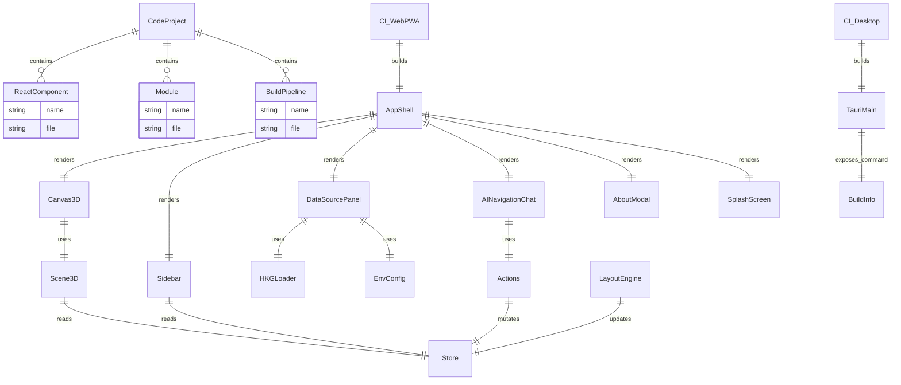

# ERD — Clean-room KG3D Navigator (Tauri + React)

Project UUID: d04ee192-2eb2-45f5-8375-55380eacbe52
Origin UUID: 01928c5d-2000-8000-8000-000000000001

Mermaid ERD

Key Entities
- Components
  - AppShell (src/components/AppShell.tsx)
  - Canvas3D (src/components/Canvas3D.tsx)
  - Scene3D (src/components/Scene3D.tsx)
  - Sidebar (src/components/Sidebar.tsx)
  - DataSourcePanel (src/components/DataSourcePanel.tsx)
  - AINavigationChat (src/components/AINavigationChat.tsx)
  - AboutModal (src/components/AboutModal.tsx)
  - SplashScreen (src/components/SplashScreen.tsx)
- Modules
  - Store (src/state/store.ts)
  - Actions (src/state/actions.ts)
  - LayoutEngine (src/services/layoutEngine.ts)
  - HKGLoader (src/services/hkgLoader.ts)
  - EnvConfig (src/config/env.ts)
  - BuildInfo (src/config/buildInfo.ts)
  - TauriMain (src-tauri/src/main.rs, src-tauri/build.rs, tauri.conf.json)
- Pipelines
  - CI_Desktop (.github/workflows/desktop.yml)
  - CI_WebPWA (.github/workflows/web.yml)

Design Notes
- React 18.2.0, single React instance via Vite resolve.alias.
- High-port MCP default: 49160 via EnvConfig (override with VITE_HKG_MCP_BASE_URL).
- Build-epoch stamping surfaced in filename, splash, and About modal.
- Tauri events replace Electron IPC; About menu calls get_build_info command.

